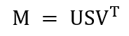
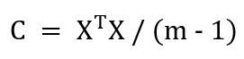
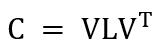
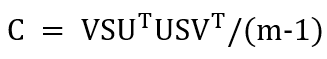
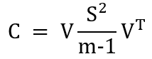

# Análisis de componentes principales con descomposición de valores singulares

En este capítulo mostraré como llevar a cabo *PCA* con funciones específicas para esta tarea en *R*. Esto nos ayudará a simplificar los pasos cada vez que necesitemos llevar a cabo este análisis.  

## Descomposición de valores singulares

La descomposición de valores singulares (*SVD* por sus siglas en inglés) es una factorización que generaliza la obtención de valores y vectores propios en matrices cuadradas (mismo número de renglones y columnas) a matrices con cualquier número de renglones y columnas:  

```{r SVD de una matriz, echo=FALSE, fig.align='center'}

```

Donde *M* es una matriz de *m* renglones y *n* columnas (*m x n*), *S* es una matriz *m x n* y *V* es una matriz *n x n*.  

Algunos puntos importantes sobre el *SVD*:  

* Los elementos en la diagonal de *S* se denominan *valores singulares* de la matriz *M*.  
* El número de valores singulares distintos de cero es igual al *rango* de la matriz *M*.
* Las columnas de *U* y las columnas de *V* se denominan *vectores singulares* de *M*.

## SVD para llevar a cabo PCA

La *SVD* puede ser usada para realizar *PCA* en un conjunto de datos ya que existe una relación estrecha entre ambos procedimientos.  

Digamos que tenemos una matriz *M* de tamaño *m x n*. En los renglones *m* especificamos las categorías, estados, muestras, tratamientos, etc., y en las columnas *n* señalamos las distintas variables medidas. Supongamos también que hemos centrado los datos, mediante la resta del promedio de cada variable, y dividido entre las desviaciones estándar. Entonces podemos calcular la matriz de covarianzas de la siguiente forma:  

```{r cálculo de la matriz de covarianza, echo=FALSE, fig.align='center'}

```

Esta matriz simétrica o cuadrada (mismo número de renglones y columnas) puede ser diagonalizada de la siguiente forma:  

```{r diagonal de la matriz de cov, fig.align='center', echo=FALSE}

```

En la ecuación anterior, *V* es la matriz de vectores propios (cada columna es un vector propio) y *L* es una matriz donde los elementos en la diagonal son los valores propios.  

Ahora bien, si llevamos a cabo *SVD* en *M* como en la primera ecuación:  

```{r primera ecuacion, fig.align='center', echo=FALSE}

```

Podemos establecer que:  

```{r cuarta ecuación, echo=FALSE, fig.align='center'}

```

Y finalmente la matriz de covarianza *C* se puede expresar como:  

```{r quinta ecuación, echo=FALSE, fig.align='center'}

```

Esto quiere decir que los vectores singulares en *V* son los vectores propios de la matriz y los valores singulares en *S* están relacionados con los valores propios mediante $ValorPropio=ValorSingular^2/(n-1)$. Los componentes principales están dados mediante la relación entre matrices $XV = US$ y los vectores propios son las columnas de la matriz $V$.  

Ahora apliquemos directamente lo que acabamos de ver para llevar a cabo un *PCA* en datos reales.  

## Datos

El conjunto de datos que usaremos en este capítulo provienen del repositorio <a href="https://github.com/genomicsclass/tissuesGeneExpression" target="_blank">tissuesGeneExpression</a>. Estos son datos de expresión genómica cuantificados en distintos tejidos humanos.  

Primero descargamos dichos datos mediante el siguiente código.  

```{r descargar datos, cache=TRUE, message=FALSE, warning=FALSE}
devtools::install_github("genomicsclass/tissuesGeneExpression")

library(tissuesGeneExpression)
data(tissuesGeneExpression)

datos_genes <- t(e)
datos_genes <- as.data.frame(datos_genes)
```

En este caso usamos la función `t()` para obtener la transpuesta de los datos originales. De este forma los renglones corresponden a las muestras de tejido y las columnas a los distintos genes.  

```{r dimension de los datos}
dim(datos_genes)
```

En este conjunto de datos se tienen 189 muestras de diferentes tejidos y un total de 22 215 genes.  

## Análisis de componentes principales con la función svd()

Para utilizar la función `svd()` para llevar a cabo *PCA*, primero centramos los datos restando la media de cada gen y dividimos entre las desviaciones estándar.  

```{r transformar los datos}
library(purrr)

# Promedio de cada gen
prom_gen <- map_dbl(datos_genes, mean)

# Desviaciones estándar de cada gen
de_gen <- map_dbl(datos_genes, sd)

# Centrar los datos y dividir entre la desviación estándar
datos_genes_c <- map2(datos_genes, prom_gen, .f = function(x, mean) x - mean)
datos_genes_c <- map2(datos_genes_c, de_gen, .f = function(x, sd) x/sd)
datos_genes_c <- data.frame(datos_genes_c)
```

Ahora podemos realizar *SVD* sobre los datos transformados.  

```{r svd en los datos}
dg_svd <- svd(datos_genes_c)
```

El objeto `dg_svd` es una lista que contiene a la matriz *U*, la matriz *V* y un vector numérico con los valores singulares.  

```{r componentes de dg_svd}
# Matriz U
dg_u <- dg_svd$u

# Matriz V
dg_v <- dg_svd$v

# Matriz con valores singulares
dg_d <- diag(dg_svd$d)
```

### Gráfica de barras para la varianza de cada componente principal

Ahora calculamos cada valor propio y el porcentaje de variación de cada componente principal.  

```{r scree plot svd}
library(dplyr)
library(ggplot2)

# Valores propios
vp <- dg_svd$d^2 / (nrow(datos_genes) - 1)

# Porcentajes de variación de cada PC
per_pc <- data.frame(vp) %>% 
  mutate(
    per_var = vp * 100 / sum(vp),
    pc = map_chr(1:nrow(dg_u), .f = function(x) paste0("PC", as.character(x))
    )
  )

# Gráfica de barras con la varianza de cada PC 
ggplot(per_pc[1:15,], aes(reorder(pc, -per_var), per_var)) +
  geom_col() +
  xlab("Componente Principal") +
  ylab("Porcentaje de variación (%)") +
  theme_classic()
```

Ya que hay 189 componentes principales y generalmente la variación está acumulada en unos cuantos de los primeros, en la gráfica anterior solo se tomaron los primeros 15 componentes.

### Representación de los datos en dos dimensiones

Primero calculamos las proyecciones de los datos originales.  

```{r proyeccion de los datos}
# Proyecciones  
dg_p <- data.frame(dg_u %*% dg_d)

# Cambiar los nombres de las columnas por los de los componente principales 
colnames(dg_p) <- map_chr(
  1:nrow(dg_p), .f = function(x) paste0("PC", as.character(x))
)

# Añadir una columna nueva con el nombre de los tejidos
dg_p <- dg_p %>% 
  mutate(Tissue = tissue) %>% 
  relocate(Tissue)
```

La nueva columna indica el nombre de los tejidos a los que corresponde cada muestra. El vector de caracteres `tissue` está incluido en los datos que descargamos al comienzo de este capítulo.  

```{r tabla de tejidos}
table(tissue)
```

Finalmente podemos realizar una gráfica de dispersión. En este caso solo utilizaré los valores de los componentes principales 1 y 2.  

```{r gráfica de dispersión con svd}
ggplot(dg_p, aes(PC1, PC2, color = Tissue)) +
  geom_point(size = 2) +
  xlab("PC1 (19.5%)") + 
  ylab("PC2 (12.3%)") +
  ggtitle("PCA en datos de expresión utilizando svd()") +
  theme_classic()
```

A pesar de que ambos componentes solo suman el 32% de la variación total en los datos, es posible observar un par de agrupaciones.  

### Vectors propios y pesos

Los vectores propios y pesos se pueden tomar directamente de la matriz *V* obtenida mediante *SVD*.  

```{r vectores propios}
dg_v[1:5, 1:5]
```

En este caso cada columna corresponde a un componente principal. Ya que tenemos un gran número de variables, realizar una gráfica de dispersión con los pesos de los primeros dos componentes no dejaría mucho en claro. Lo que sí podemos hacer es ordenar los valores absolutos de los pesos de mayor a menor para tener una idea de los genes con mayor contribución en ambos componentes.  

```{r pesos de mayor a menor}
# Seleccionar los vectores propios correspondiente a PC 1 y 2
pesos_pc12 <- dg_v[, 1:2] %>% 
  as.data.frame() %>% 
  rename(PC1 = "V1", PC2 = "V2")

# Asignar los nombres de cada renglón a su respectivo gen
rownames(pesos_pc12) <- colnames(datos_genes)

# Valores absolutos y ordenamiento de mayor a menor para PC1
pesos_pc1 <- pesos_pc12 %>% 
  select(PC1) %>% 
  mutate(PC1 = abs(PC1)) %>% 
  arrange(desc(PC1))
```

De esta forma, se pueden observar los primeros diez genes con mayor peso en *PC1*.  

```{r pesos PC1}
head(pesos_pc1, n = 10)
```

Un procedimiento similar se puede seguir para *PC2*.  

```{r pesos PC2}
pesos_pc2 <- pesos_pc12 %>% 
  select(PC2) %>% 
  mutate(PC2 = abs(PC2)) %>% 
  arrange(desc(PC2))

head(pesos_pc2, n = 10)
```

## Análisis de componente principales con la función prcomp()

Una manera mucho más directa de realizar *PCA* es con la función `prcomp()`. Esta función utiliza *SVD* y no requerimos de instalar ningún paquete adicional ya que se incluye en las funciones base de *R*. Al utilizar esta función tampoco necesitamos hacer operaciones o trasformaciones directas sobre los datos originales.  

```{r PCA con prcomp}
dg_prcomp <- prcomp(datos_genes, scale. = TRUE)
```

El argumento `scale. = TRUE` especifica que los datos se dividan entre las desviaciones estándar, lo cual siempre es recomendable.  

### Gráfica de barras para la varianza de cada componente principal

Para hacer una gráfica con los porcentajes de variación de cada componente principal, utilizamos los valores en `sdev` contenidos en `dg_prcomp`.  

```{r porcentajes con prcomp}
# Valores propios
vp_prcomp <- dg_prcomp$sdev^2 / (nrow(datos_genes) - 1)

# Porcentaje de variación para cada componente principal
per_pc <- data.frame(vp_prcomp) %>% 
  mutate(
    per_var = vp_prcomp * 100 / sum(vp_prcomp),
    pc = map_chr(
      1:nrow(dg_prcomp$x), .f = function(x) paste0("PC", as.character(x))
      )
  )

# Gráfica con los porcentajes de variación de los primeros 15 componentes
ggplot(per_pc[1:15,], aes(reorder(pc, -per_var), per_var)) +
  geom_col() +
  xlab("Componente principal") +
  ylab("Porcentaje de variación (%)") +
  theme_classic()
```

Esta gráfica es la misma que la obtenida al realizar *PCA* con `svd()`.  

### Representación de los datos en dos dimensiones

Las proyecciones de nuestros datos están en el objeto `x` dentro de `dg_prcomp`.  

```{r proyecciones con prcomp}
# Proyecciones
dg_p <- dg_prcomp$x %>% 
  as.data.frame() %>% 
  mutate(Tissue = tissue) %>% 
  relocate(Tissue)

# Gráfica de dispersión de los primeros dos componente
ggplot(dg_p, aes(PC1, PC2, color = Tissue)) +
  geom_point(size = 2) +
  xlab("PC1 (33%)") + 
  ylab("PC2 (14%)") +
  ggtitle("PCA en datos de expresión utilizando prcomp()") +
  theme_classic()
```

Está gráfica también es la misma que al realizar el *PCA* mediante *svd()*.  

### Vectores propios y pesos

Los vectores propios y pesos se pueden tomar directamente de `rotation` dentro de `dg_prcomp`.  

```{r pesos prcomp}
dg_prcomp$rotation[1:5, 1:5]
```

En este caso no es necesario cambiar nombres o asignarlos.

```{r pesos pc1 prcomp}
pesos_pc1 <- dg_prcomp$rotation %>% 
  as.data.frame() %>% 
  select(PC1) %>% 
  mutate(PC1 = abs(PC1)) %>% 
  arrange(desc(PC1))

head(pesos_pc1, n = 10)  
```

Esta tabla también es la misma a la que obtuvimos con `svd()`. La obtención de la tabla para *PC2* se deja como ejercicio para el lector.