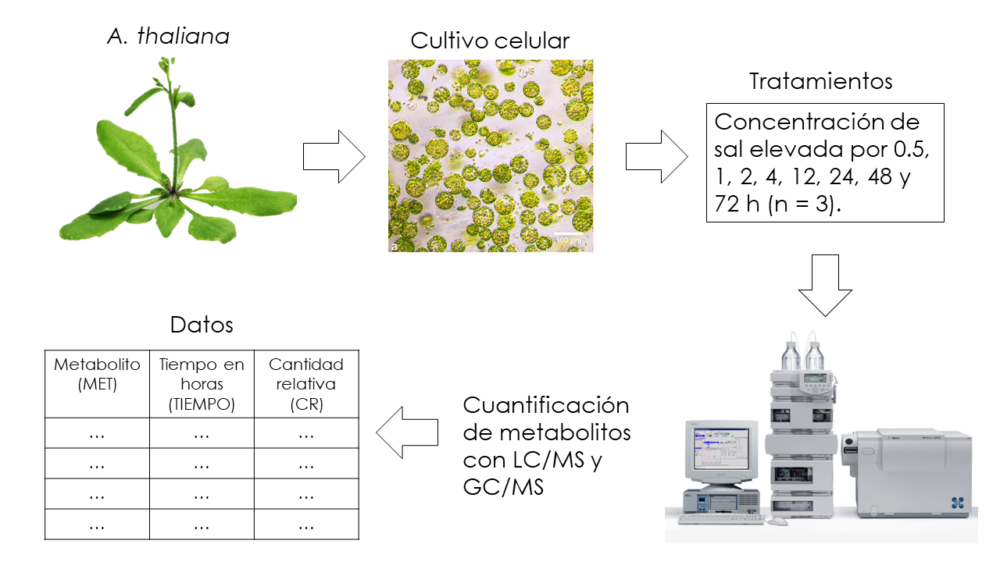

# Análisis de componentes principales aplicado a metabolómica

Es hora de poner en práctica todo lo que hemos abordado en los capítulos anteriores.  

## Datos

Los datos en este capítulo fueron generados aleatoriamente a partir de las medias y desviaciones estándar publicadas en <a href="https://pubmed.ncbi.nlm.nih.gov/17118972/" target="_blank">Time-course metabolic profiling in Arabidopsis thaliana cell cultures after salt stress treatment</a>. Si el lector tiene curiosidad puede consultar el archivo "simulacion_datos_met.R" en la carpeta "codigoR" situada en el repositorio de este manual. Los datos también se encuentran en el mismo repositorio dentro la carpeta datos.  

Los datos corresponden a un experimento con plantas de *Arabidopsis thalania*, de la cuales se realizaron cultivos celulares que fueron sometidos a distintos tiempos de estrés salino. El estrés salino es un factor importante que limita el crecimiento de las plantas y en el estudio estaban interesados en cómo cambia el nivel de algunos metabolitos primarios en estas condiciones.  

```{r experimento met, echo=FALSE, fig.align='center'}

```

Como dato extra, la metabolómica es el estudio de las moléculas producidas por metabolismo celular, ya sea de plantas, bacterias, animales, etc.  

Las primeras diez columnas de nuestros datos se ven de la siguiente forma.  

```{r importar datos, message=FALSE, warning=FALSE}
library(dplyr)

datos_met <- readr::read_csv("datos/datos_met_completos.csv")
head(datos_met, n = 10)
```

Es estos datos, `CR` signific "Cantidad Relativa" mientras que `Muestra` se refiere a las repeticiones por tratamiento o tiempo, que en cada caso fueron tres.  

## Reordenamiento de los datos

Los datos como se muestran en la sección anterior están registrados de la manera usual y necesaria para hacer análisis de varianza o regresión. Pero en el caso de *PCA* necesitamos reordenarlos de tal manera que en las columnas se especifique cada variable (la cantidad relativa de cada metabolito) y en los renglones los pares muestra-tiempo.  

```{r reordenar los datos}
library(tidyr)

dt_r <- datos_met %>% 
  mutate(Muestra_Tiempo = paste0(Muestra, "-", Tiempo)) %>% 
  pivot_wider(
    names_from = Muestra_Tiempo, values_from = CR, -Tiempo:-Muestra
  )

met_cr <- t(dt_r[, -1])
colnames(met_cr) <- dt_r$Metabolito

met_cr[1:10, 1:5]
```

## Análisis de componentes principales con prcomp()

Ahora que nuestros datos tienen la estructura adecuada podemos realizar el *PCA* con la función `prcomp()`.  

```{r pca met}
met_pca <- prcomp(met_cr, scale. = TRUE)
```

Como vimos en el capítulo anterior `prcomp()` devuelve un listado con las proyecciones de los datos, los pesos y valores propios de la matriz de covarianzas. También podemos utilizar la función `summary()` para desplegar un resumen donde solo se mostrará información sobre las varianzas y desviaciones estándar de cada componente principal.  

```{r resumen met pca}
summary(met_pca)
```

### Gráfica de barras con la varianza de cada componente principal

```{r barras varianza pca}
library(ggplot2)
library(purrr)

# Valores propios
vp_prcomp <- met_pca$sdev^2 / (nrow(datos_met) - 1)

# Porcentaje de variación para cada componente principal
per_pc <- data.frame(vp_prcomp) %>% 
  mutate(
    per_var = vp_prcomp * 100 / sum(vp_prcomp),
    pc = map_chr(
      1:nrow(met_pca$x), .f = function(x) paste0("PC", as.character(x))
      )
  )

# Gráfica con porcentajes para los primeros 15 componentes 
ggplot(per_pc[1:15,], aes(reorder(pc, -per_var), per_var)) +
  geom_col(fill = "cornflowerblue", color = "black") +
  xlab("Componente principal") +
  ylab("Porcentaje de variación (%)") +
  theme_classic()
```

Los primeros dos componentes abarcan alrededor del 70% de la variación total en los datos, por lo que una gráfica de dispersión con estos dos componentes nos podría dar una idea de las semejanzas o diferencias entre los distintos tiempos de estrés salino.  

### Gráfica de dispesión con los primeros dos componentes

Podemos darle un aspecto interactivo a nuestra gráfica de dispersión con la función `ggploty()` del paquete `plotly`. 

```{r grafica disp con PC1 y 2, message=FALSE, warning=FALSE}
library(plotly)

# Porcentajes de variación de los primeros dos componentes
per_var_pc12 <- round(per_pc$per_var[1:2], 1)

# Tiempos
tiempo <- as.factor(substr(rownames(met_pca$x), start = 3, stop =5))
levels(tiempo) <- c("0.5", "1", "2", "4", "12", "24", "48", "72")

# Proyecciones
met_p <- met_pca$x %>% 
  as.data.frame() %>% 
  mutate(Tiempo = tiempo) %>% 
  relocate(Tiempo)

# Gráfica de dispersión de los primeros dos componente
pc12 <- ggplot(met_p, aes(PC1, PC2, color = Tiempo)) +
  geom_point(size = 2) +
  xlab(paste0("PC1 ", "(", per_var_pc12[1], "%)")) + 
  ylab(paste0("PC2 ", "(", per_var_pc12[2], "%)")) +
  theme_classic() +
  scale_color_brewer(palette = "Dark2")

ggplotly(pc12)
```

Podemos observar una clara diferenciación entre los distintos tiempos de estrés. En particular el tiempo de 72 horas a lo largo de *PC1* y el tiempo de 12 horas a lo largo de *PC2*.  

### Peso o *loadings* de PC1 y PC2

Para determinar qué metabolitos son los que tienen una mayor peso o importancia en las agrupaciones o diferencias observadas en la gráfica anterior, podemos realizar una gráfica de paletas (*lollipop chart*) con los pesos absolutos de cada metabolito (ordenados de mayor a menor). Los pesos se encuentran en `rotation` dentro de los resultados devueltos por `prcomp()`.  

Primero observemos los referente al primer componente principal.  

```{r paleta pesos PC1}
# Obtener los pesos correspondientes de PC1
pesos_pc1 <- met_pca$rotation %>% 
  as.data.frame() %>% 
  select(PC1) %>% 
  mutate(Metabolito = row.names(met_pca$rotation)) %>% 
  mutate(PC1 = round(abs(PC1), 3)) %>% 
  rename(Peso = PC1)

# Gráfica de paletas con pesos de mayor a menor
lolch_ppc1 <- pesos_pc1 %>% 
  ggplot(aes(x = Peso, y = reorder(Metabolito, Peso))) + 
  geom_segment(aes(x = 0, xend = Peso, yend = Metabolito), color = "black") +
  geom_point(col = "black", pch = 21, bg = "#EE3B3B") +
  xlab("Peso") +
  ylab("Metabolito") +
  ggtitle("Pesos o loadigns en PC1") +
  theme_classic()

# Aspecto interactivo con ggplotly()
ggplotly(lolch_ppc1)
```

Para los pesos del segundo componente principal seguimos el mismo procedimiento.  

```{r paleta pesos PC2}
# Obtener los pesos correspondientes de PC1
pesos_pc2 <- met_pca$rotation %>% 
  as.data.frame() %>% 
  select(PC2) %>% 
  mutate(Metabolito = row.names(met_pca$rotation)) %>% 
  mutate(PC2 = round(abs(PC2), 3)) %>% 
  rename(Peso = PC2)

# Gráfica de paleta con pesos de mayor a menor
lolch_ppc2 <- pesos_pc2 %>% 
  ggplot(aes(x = Peso, y = reorder(Metabolito, Peso))) + 
  geom_segment(aes(x = 0, xend = Peso, yend = Metabolito), color = "black") +
  geom_point(col = "black", pch = 21, bg = "#EE3B3B") +
  xlab("Peso") +
  ylab("Metabolito") +
  ggtitle("Pesos o loadigns en PC2") +
  theme_classic()

# Aspecto interactivo con ggplotly()
ggplotly(lolch_ppc2)
```

¿Cómo varían las cantidades de estos compuestos respecto al tiempo de estrés salino? Un primer paso podría ser realizar análisis de una sola variable en los metabolitos de mayor importancia (ANOVA y comparaciones múltiples).  

¿Qué significa que algún metabolito tenga una mayor importancia o relevancia? La respuesta a esta pregunta dependerá del marco teórico de la investigación, tal vez algunos de estos compuestos tengan un papel central en el control del metabolismo ante situaciones de estrés.  