# Una Shiny App para automatizar el análisis de componentes principales

En este capítulo veremos como descargar y utilizar una *Shiny App* para llevar a cabo *PCA*. Esto puede considerarse una manera de automatizar el análisis para que no sea necesario escribir todo el código cada vez que lo necesitemos. Por cierto, la aplicación esta hecha por el autor de este manual y todo el código es de libre uso y acceso, por lo que, si tienes experiencia con *Shiny*, puedes adaptar, modificar o mejorar la aplicación.  

## ¿Qué es *PCA Maker*?

*PCA Maker* es una aplicación *Shiny* que permite hacer y mostrar análisis de componentes principales a partir de datos en formato *CSV* o *TSV*.  

## Instalar y usar 

En *R* o *R Studio*, tienes dos opciones para utilizar *PCA Maker*.  

### Descargar de GitHub

Simplemente descarga la aplicación de *GitHub*, da clic en el siguiente enlace: <a href="https://github.com/ciencia-libre/PCA-Maker" target="_blank">PCA-Maker</a>. Una vez en la carpeta de principal de *PCA Maker*, da doble clic en el archivo *PCA-Maker.Rproj*:  

```{r fig 1, echo=FALSE, fig.align='center', message=FALSE, warning=FALSE}
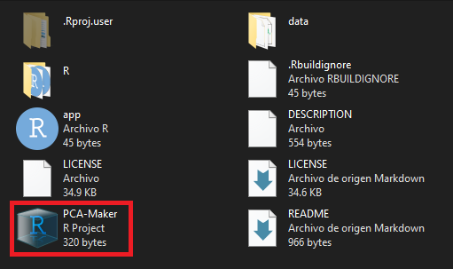
```

En la consola de *R* escribe `devtools:load_all(".")` (necesitas instalar el paquete `devtools`) y después `PCAMaker()`. También puedes correr el código en *app.R*, el cual está en la carpeta principal de la aplicación.  

### Como un paquete 

Instala la aplicación como un paquete con el código `devtools::install_github("ciencia-libre/PCA-Maker")` y posteriormente escribe `library(PCAMaker)` y `PCAMaker()`.  

Al escribir `PCAMaker()` en la consola y presionar *Enter* se desplegará la aplicación y podrás navegar libremente por cada pestaña. Nota que la aplicación muestra un ejemplo pre-cargado. Este ejemplo corresponde a los datos de muestras de vino del capítulo tres.  

```{r fig 2, echo=FALSE, fig.align='center'}
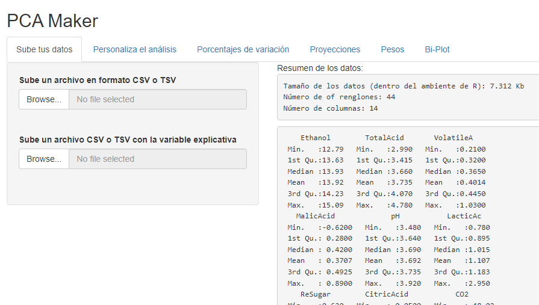
```

## Ejemplo

Para este ejemplo utilizaremos lo datos de metabolómica del capítulo cinco, pero con una pequeña diferencia en su estructura. Dichos archivos están en la carpeta `data` del directorio principal de la aplicación. 

### Datos 

Los datos están en los archivos *Met_quantities_data.csv* y *Met_time.csv*.

Para utilizar `PCA Maker` necesitamos dos archivos, uno con los datos de las respuestas o variables medidas (*Met_quantities_data.csv*):  

```{r fig 3, echo=FALSE, fig.align='center'}
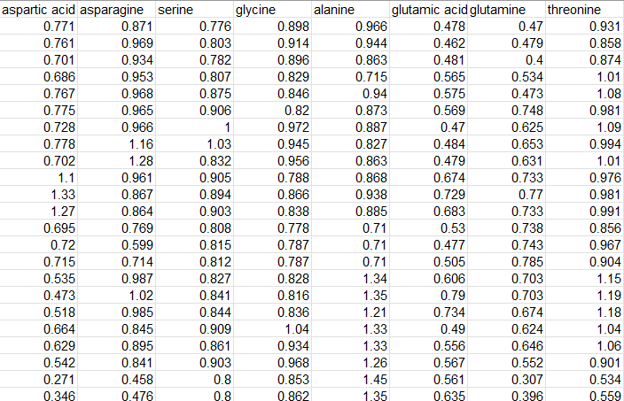
```

Y otro archivo donde especifiquemos las distintas categorías, estados, tratamientos o cualquier variable explicativa asociada a nuestras mediciones (*Met_time.csv*):  

```{r fig 4, echo=FALSE, fig.align='center'}
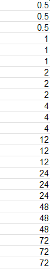
```

Es importante asegurarnos que ambos conjuntos de datos tengan el mismo número de renglones.  

### Subir o cargar los datos

Para subir o cargar nuestros datos, solo hay que hacer clic en el panel izquierdo en los botones `Browse...`. Esto abrirá una ventana que nos permitirá buscar y cargar nuestros datos.  

```{r fig 5, echo=FALSE, fig.align='center'}
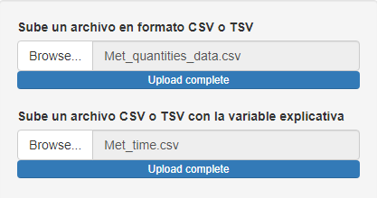
```

Una vez que carguemos los datos, el panel derecho desplegará un resumen de las variables respuesta:  

```{r fig 6, echo=FALSE, fig.align='center'}
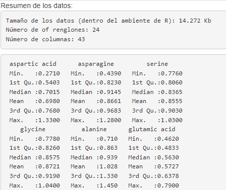
```

Y al final se mostrará una tabla de frecuencias de nuestra variable explicativa:  

```{r fig 7, echo=FALSE, fig.align='center'}
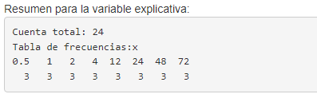
```

### Personalizar el análisis

En esta pestaña podemos escoger si las respuestas estarán centradas respecto a su media y divididas entre su desviación estándar. Ambas operaciones son opcionales, pero siempre recomendables en *PCA*.

```{r fig 8, echo=FALSE, fig.align='center'}
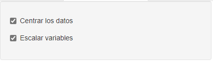
```

En el panel de la derecha se desplegará un resumen del *PCA*, donde básicamente solo se muestra información referente a la variación de cada componente principal.  

```{r fig 9, echo=FALSE, fig.align='center'}
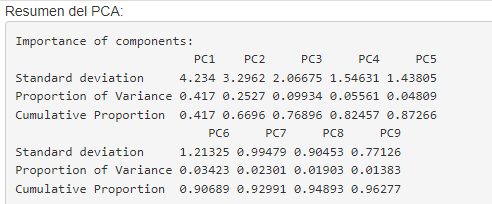
```

### Porcentajes de variación

En el panel izquierdo de esta pestaña podemos personalizar el número de componentes en la gráfica de barras. También podemos descargar la figura en distintos formatos y los datos de porcentajes de variación en un archivo CSV.  

```{r fig 10, echo=FALSE, fig.align='center'}
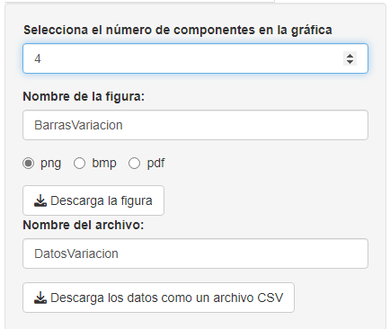
```

En el panel derecho podremos observar la gráfica de barras con los porcentajes de variación.  

```{r fig 11, echo=FALSE, fig.align='center'}
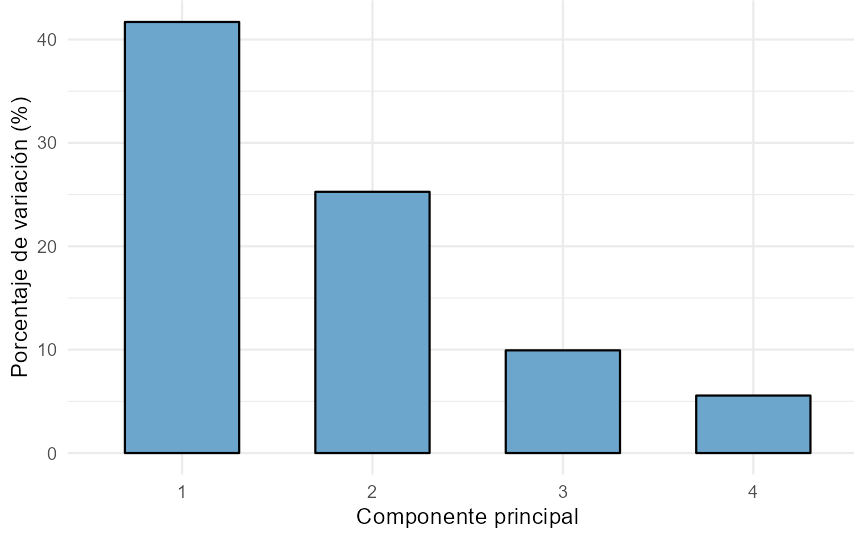
```

### Proyecciones 

En el panel izquierdo de esta pestaña podremos seleccionar los componentes principales que incluiremos en la gráfica de dispersión y también podremos descargar la figura y los datos en formato CSV.  

```{r fig 12, echo=FALSE, fig.align='center'}
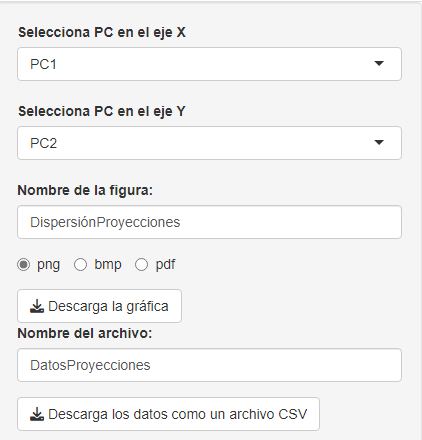
```

En el panel derecho veremos la gráfica de dispersión con los componentes que seleccionamos. Los colores corresponden a cada nivel de la variable explicativa, y el porcentaje de variación de cada componente principal se indica entre paréntesis.  

```{r fig 13, echo=FALSE, fig.align='center'}
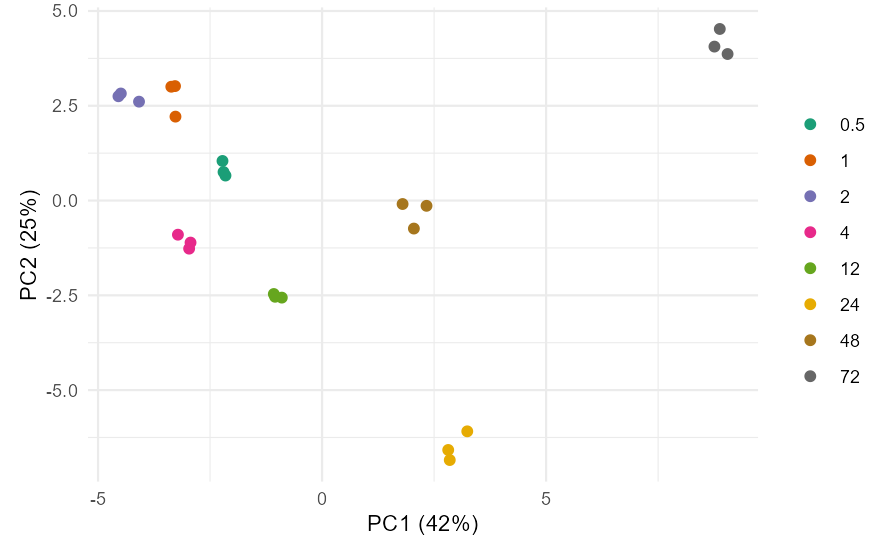
```

### Pesos

De forma similar, en el panel izquierdo podremos seleccionar los componentes principales en la gráfica y descargar los *loadings* en formato CSV.  

```{r fig 14, echo=FALSE, fig.align='center'}
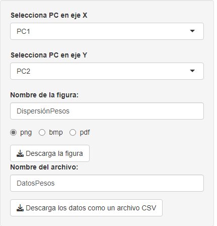
```
  
En el panel derecho veremos la gráfica de dispersión con los pesos. Hay que resaltar que entre más variables respuesta tengamos la gráfica será más difícil de interpretar por el gran número de puntos y nombres traslapados.   

```{r fig 15, echo=FALSE, fig.align='center'}
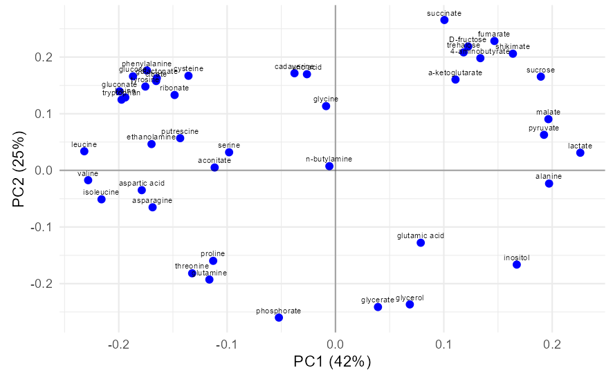
```

### *Bi-plot*

La gráfica en el panel derecho de esta pestaña conjunta las dos gráficas previas y también, entre más variables respuesta tengamos, puede que no sea una buena alternativa de visualización.  

```{r fig 16, echo=FALSE, fig.align='center'}
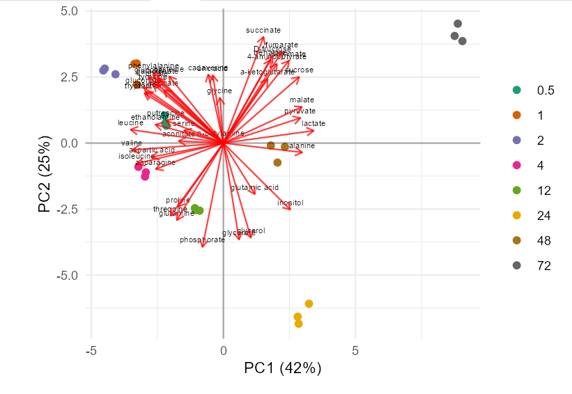
```

El panel izquierdo también permite seleccionar los componentes y descargar la figura en distintos formatos.  

```{r fig 17, echo=FALSE, fig.align='center'}
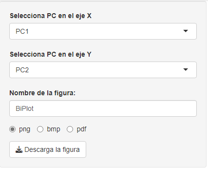
```