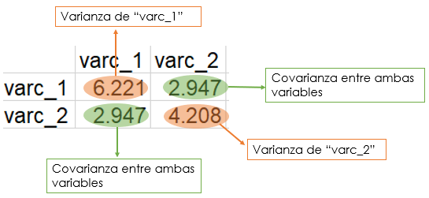

# Análisis de componentes principales en dos dimensiones

Es hora de abordar el tema principal de este manual. De aquí en adelante abreviaré el nombre de "análisis de componentes principales" como *PCA* por sus siglas en inglés.   

El *PCA* es un análisis exploratorio de datos basado en la reducción de dimensiones. La idea general es reducir el conjunto de datos para que tenga menos dimensiones y, al mismo tiempo, conservar la mayor cantidad de información posible.  

El *PCA* nos permite hacer representaciones visuales en dos dimensiones y comprobar si hay grupos o diferencias en los datos relacionados con diferentes estados, tratamientos, etc. Además, podemos obtener alguna pista sobre qué variables en los datos son responsables de las diferencias visuales.  

Es importante destacar que el *PCA* no se utiliza exclusivamente para lo anterior y como es un análisis exploratorio las similitudes o diferencias de los datos deben ser consideradas en el contexto del que provienen.  

Comencemos con un caso simple que nos ayudará a comprender el *PCA*. Utilizaré solo dos variables para mostrar algunos conceptos básicos detrás y luego podremos generalizar a datos con más dimensiones.  

## Datos

Para la primera variable tomé como base una distribución normal, y para la segunda consideré cierto grado de dependencia con la primera y añadí un poco de ruido también con una distribución normal.  


```r
set.seed(1)

# Variable 1
var_1 <- rnorm(50, 50, sd = 3)

# Variable 2
var_2 <- .5*var_1 + rnorm(50, sd = sqrt(3))

# Ambas variables en un "data.frame"
datos_1 <- data.frame(var_1, var_2)

head(datos_1)
```

```
##      var_1    var_2
## 1 48.12064 24.74986
## 2 50.55093 24.21540
## 3 47.49311 24.33739
## 4 54.78584 25.43681
## 5 50.98852 27.97633
## 6 47.53859 27.19945
```

Un gráfico de dispersión puede mostrar la dispersión y la posible relación entre ambas variables:  


```r
library(ggplot2)

ggplot(datos_1, aes(x = var_1, y = var_2)) +
  geom_point(color = "blue", size = 2) +
  xlab("Variable 1") +
  ylab("Variable 2") +
  theme_classic()
```


## Centrar los datos

El primer paso del *PCA* es centrar las dos variables respecto a su media.  


```r
library(dplyr)

datos_1 <- datos_1 %>% 
  mutate(varc_1 = var_1 - mean(var_1), varc_2 = var_2 - mean(var_2))

head(datos_1)
```

```
##      var_1    var_2     varc_1      varc_2
## 1 48.12064 24.74986 -2.1807063 -0.60402890
## 2 50.55093 24.21540  0.2495851 -1.13848362
## 3 47.49311 24.33739 -2.8082307 -1.01649408
## 4 54.78584 25.43681  4.4844976  0.08291914
## 5 50.98852 27.97633  0.6871785  2.62244372
## 6 47.53859 27.19945 -2.7627500  1.84556287
```

Lo anterior no modifica la posición relativa entre cada punto, por lo que los datos centrados tienen el mismo aspecto.  


```r
ggplot(datos_1, aes(x = varc_1, y = varc_2)) +
  geom_point(color = "blue", size = 2) +
  geom_vline(xintercept = 0, size = .5) +
  geom_hline(yintercept = 0, size = .5) +
  xlab("Variable 1 (valores centrados)") +
  ylab("Variable 2 (valores centrados)") +
  theme_classic()
```


## Calcular la matriz de covarianza

Se puede calcular la *matriz de covarianza* para un conjunto dado de variables simplemente realizando una multiplicación de matrices en los datos centrados.  


```r
# Seleccionar las variables centradas
datos_2 <- datos_1 %>% 
  select(varc_1, varc_2) %>% 
  as.matrix()

# Calcular la matriz de covarianza
cov_m <- (t(datos_2) %*% datos_2) / (nrow(datos_2) - 1) 

cov_m
```

```
##          varc_1   varc_2
## varc_1 6.220943 2.946877
## varc_2 2.946877 4.207523
```

En esta matriz, la diagonal contiene las varianzas de cada variable, mientras que los valores fuera de la diagonal son las covarianzas entre ellas (véase la siguiente figura).  



El mismo resultado se puede obtener con la función `cov()`.  


```r
cov(datos_2)
```

```
##          varc_1   varc_2
## varc_1 6.220943 2.946877
## varc_2 2.946877 4.207523
```

O también con la función `crossprod()` de la siguiente forma.  


```r
crossprod(datos_2) / (nrow(datos_2) - 1)
```

```
##          varc_1   varc_2
## varc_1 6.220943 2.946877
## varc_2 2.946877 4.207523
```

## Obtener los valores y vectores propios de la matriz de covarianza

Los *componentes principales* son "líneas" o direcciones que capturan la mayor parte de la información en los datos. Estas direcciones pueden obtenerse calculando los valores y vectores propios de la matriz de covarianza.  


```r
# Función eigen() para obtener los vectores y valores propios
cov_e <- eigen(cov_m)

# Vectores propios
e_vec <- cov_e$vectors

# Valores propios
e_val <- cov_e$values
```

La extensión de cada vector propio (*span* en inglés) puede considerarse la "línea" que capta la mayor parte de la variación.  


```r
# Primer vector propio 
ev_1 <- e_vec[,1]

# Pendiente del primer vector propio
ev1_m <- ev_1[2] / ev_1[1]

# Segundo vector propio 
ev_2 <- e_vec[,2]

# Pendiente del segundo vector propio
ev2_m <- ev_2[2] / ev_2[1]

# Gráfica de dispersión de los datos centrados mostrando la extensión de
# cada vector propio
ggplot(data.frame(datos_2), aes(x = varc_1, y = varc_2)) +
  geom_point(color = "blue", size = 2) +
  geom_vline(xintercept = 0, size = .5) +
  geom_hline(yintercept = 0, size = .5) +
  geom_abline(slope = ev1_m, color = "blue", size = 0.7) +
  geom_abline(slope = ev2_m, color = "red", size = 0.7) +
  xlab("Variable 1 (valores centrados)") +
  ylab("Variable 2 (valores centrados)") +
  theme_classic()
```


## Gráfica de barras para la varianza de cada componente principal

Al dividir cada valor propio por *n - 1*, donde *n* es el número de renglones en los datos originales, obtendremos una estimación de la varianza de cada componente principal. La suma de todas las varianzas (la varianza total) puede utilizarse para calcular el porcentaje de variación de cada componente y, finalmente, podemos visualizar los porcentajes con una gráfica de barras (en inglés a esta gráfica se le conoce como *Scree plot*).  


```r
# Calcular la varianza estimada para cada valor propio
e_var <- e_val / (nrow(datos_2) - 1)

# "Data frame" con los porcentajes de variación
var_per <- data.frame(
  PC  = c("PC1", "PC2"),
  PER = c(e_var) * 100 / sum(e_var) # Calcular los porcentajes
)

# "Scree plot" 
ggplot(var_per, aes(x = PC, y = PER)) +
  geom_col(width = 0.5, color = "black") +
  xlab("Componente principal") +
  ylab("Porcentaje de variación (%)") +
  theme_classic()
```


## Pesos (*Loading scores*)

Los vectores propios obtenidos mediante la función `eigen()` están normalizados. Esto quiere decir que su longitud es igual a 1.  


```r
# Norma del primer vector propio
norm(as.matrix(ev_1), "F")
```

```
## [1] 1
```

```r
# Norma del segundo vector propio
norm(as.matrix(ev_2), "F")
```

```
## [1] 1
```

Los elementos de cada vector propio también se denominan *pesos* (*loadings* en inglés) y pueden interpretarse como la contribución de cada variable en los datos originales a un componente principal en específico, o, más estrictamente, se pueden interpretar como los coeficientes de la combinación lineal de las variables originales a partir de las cuales se construyen los componentes principales.  

Puedes realizar una tabla con estos valores y observar las contribuciones de cada variable a cada componente principal.  


```r
# "Data frame" con ambos valores propios
loads <- data.frame(
  VAR   = c("var_1", "var_2"),
  PC1 = ev_1, # Primer vector propio
  PC2 = ev_2  # Segundo vector propio
)

loads
```

```
##     VAR        PC1        PC2
## 1 var_1 -0.8134113  0.5816890
## 2 var_2 -0.5816890 -0.8134113
```

Lo anterior puede ser útil en datos con muchas dimensiones para establecer qué variables son las causantes de las agrupaciones o diferencias en las gráficas de dispersión del *PCA*.  

## Representar los datos en menos dimensiones

Cambiar la base de los datos originales por la indicada por los vectores propios, producirá una "rotación" de los datos.  


```r
# Inversa de la matriz con los vectores propios
inv_evec <- solve(e_vec) 

# Cambio de base de los datos originales
datos_3 <- datos_2 %*% inv_evec

# Gráfica de dispersión donce se muestra la dispersión
ggplot(data.frame(datos_3), aes(X1, X2)) +
  geom_point(color = "blue", size = 2) +
  geom_vline(xintercept = 0, size = .5) +
  geom_hline(yintercept = 0, size = .5) +
  xlab("PC1 (78.8%)") +
  ylab("PC2 (21.2%)") +
  theme_classic()
```


Podemos comparar la gráfica anterior con la de los datos originales para tener una idea más clara de como se rotaron los datos una vez que cambiamos su base.  


```r
library(ggpubr)

# Gráfica de dispersión con los datos centrados 
dg <- ggplot(data.frame(datos_2), aes(varc_1, varc_2)) +
  geom_point(color = "blue", size = 2) +
  geom_vline(xintercept = 0, size = .5) +
  geom_hline(yintercept = 0, size = .5) +
  ylim(c(-8, 8.5)) +
  ggtitle("Datos originales (Centrados)") +
  theme_classic()

# Gráfica de dispersión con los datos rotados
dr <- ggplot(data.frame(datos_3), aes(X1, X2)) +
  geom_point(color = "blue", size = 2) +
  geom_vline(xintercept = 0, size = .5) +
  geom_hline(yintercept = 0, size = .5) +
  xlab("PC1 (78.8%)") +
  ylab("PC2 (21.2%)") +
  ylim(c(-8, 8.5)) +
  ggtitle("Cambio de base") +
  theme_classic()

# Ambas gráficas lado a lado
ggarrange(dg, dr)
```


Ya que el componente principal 1 (*PC1*) explica la mayor parte de la variación en los datos, podemos omitir el componente principal 2 (*PC2*) y representar cada punto en una sola dimensión. A continuación represento los datos en una sola dimensión con puntos rojos.  


```r
# Datos del componente principal 1
datos_pc1 <- data.frame(v1 = datos_3[,1], v2 = rep(0, nrow(datos_3)))

# Gráfica de dispersión mostrando los datos de PC1
ggplot(data.frame(datos_3), aes(X1, X2)) +
  geom_point(color = "blue", size = 2) +
  geom_point(data = datos_pc1, aes(v1, v2), color = "red", size = 2) +
  geom_vline(xintercept = 0, size = .5) +
  geom_hline(yintercept = 0, size = .5) +
  xlab("PC1 (78.8%)") +
  ylab("PC2 (21.2%)") +
  ylim(c(-8, 8.5)) +
  theme_classic()
```


Las ideas anteriores pueden utilizarse en datos con muchas variables para reducir las dimensiones y representar los datos con gráficos de dispersión en dos dimensiones.  
