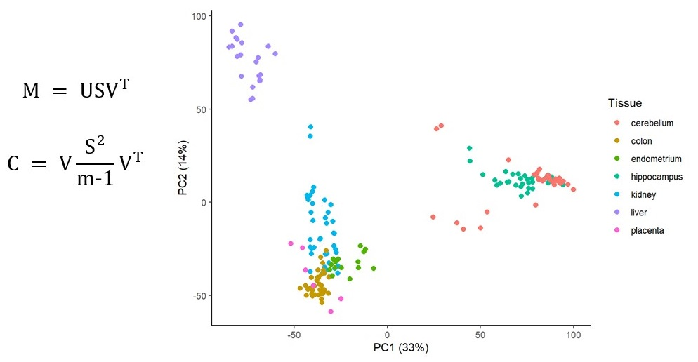

# Sobre este manual

Este documento es una guía de cómo realizar análisis de componentes principales (*PCA*, por sus siglas en inglés) con R. Incluye una pequeña introducción al álgebra lineal, se expone el caso más simple de *PCA* en dos dimensiones y posteriormente se generaliza a más de tres dimensiones. También se expone un ejemplo aplicado al área de metabolómica y como un pequeño extra se aborda cómo utilizar una *Shiny App* que nos permita realizar *PCA* de manera automática.

Para seguir este manual sin problemas se necesita ser un usuario de *R* con cierta experiencia. Al menos recomiendo saber lo básico de este lenguaje de programación, lo que sin duda incluye saber definir objetos y funciones, instalar y utilizar paquetes, así como la utilización de los paquetes incluidos en `tidyverse`. De forma opcional, también recomiendo utilizar *R Studio*, lo que facilita el trabajo con *R* de muchas formas. El primer capítulo de este manual aborda operaciones de álgebra lineal, por lo que recomiendo tener nociones de esta materia en un nivel básico. Al final se incluye un listado de referencias que pueden ser de utilidad si el lector o lectora no tiene mucha experiencia con lo que acabo de mencionar. En particular *R para ciencia de datos* es un excelente punto de partida para aprender a utilizar *R* y `tidyverse`.

Cabe destacar que este manual hace énfasis en la utilización del *PCA* como una metodología para explorar datos, con ejemplos concretos en análisis de vinos, genómica y metabalómica de plantas. El *PCA* también puede utilizarse en *Machine learning* con el objetivo de reducir las dimensiones y peso de los datos y de esta forma acelerar el proceso en conjunto. Nada de esto último se aborda en este manual.

Los capítulos en este manual son básicamente traducciones y adaptaciones de las publicaciones originales en mi blog <a href="https://r-inthelab.net/" target="_blank">*R in the lab*</a>. Al igual que en mi blog, todo el contenido de este manual está bajo licencia [Creative Commons Attribution 4.0 International License](http://creativecommons.org/licenses/by/4.0/). Lo anterior implica que las personas que accedan a este manual pueden descargar, copiar, modificar y usar el texto, el código y las figuras con cualquier fin, siempre y cuando se haga la adecuada mención a la publicación original.

El repositorio del libro con todo el código, texto y figuras para su creación se encuentran en el repositorio: <a href="https://github.com/ciencia-libre/Manual-PCA" target="_blank">Manual PCA</a>.

## Un poco acerca del autor

Me gustaría resaltar que yo, el autor de este manual, no me especializo ni me dedico formalmente a la ciencia de datos o a la estadística, por lo que posiblemente el contenido de esta publicación no estará libre de omisiones o errores. Lo que sí puedo afirmar es que llevó unos seis años utilizando *R* y *R Studio* y a lo largo de todo este tiempo, he aprendido a utilizar diversas herramientas relacionadas con el análisis de datos, con la porgramación de *Shiny Apps* y la creación de blogs. También tengo un certificado profesional por *HarvardX* que puedes consultar en el siguiente enlace: <a href="https://credentials.edx.org/credentials/9a960e8e8f9b42a39bb4695935dd7031/" target="_blank">Data Analysis for Life Sciences</a>.

Este es mi primer intento de realizar una publicación tipo manual con la ayuda del paquete *bookdown*. Me considero alguien autodidacta y sé bien que el conocimiento solo se puede asimilar realmente al compartir eso que acabas de aprender. Este manual y todas mis publicaciones son un intento por compartir y contribuir a mi comunidad. Donde quiera que estés y quienquiera que seas espero que todo lo abordado en cada capítulo te sea de utilidad y te contagié un poco de mi pasión por aprender. ¡Ojalá lea algo tuyo muy pronto, no dudes en compartirlo!

Por favor, si detectas cualquier tipo de error o tienes cualquier tipo de duda sobre el contenido de este manual contáctame a través de mi correo electrónico ([jpch_26\@outlook.com](mailto:jpch_26@outlook.com){.email}) o facebook (<https://www.facebook.com/jpch26>). También puedo echarte una mano con tu aprendizaje de *R* y *R Studio* a un nivel básico 😉.

Ya por último, si está dentro de tus posibilidades, considera invitarme un cafecito a través de mi página de ko-fi ☕: <a href="https://ko-fi.com/juanpach" target="_blank">Ko-fi de JPCH</a>. ¡Muchas gracias y hasta la próxima!

## Paquetes utilizados para la escritura de este manual

Para la creación de este manual se utilizaron los paquetes listados a continuación, también se incluye la información de mi sistema operativo y otros datos.


```
## ─ Session info ───────────────────────────────────────────────────────────────
##  setting  value
##  version  R version 4.2.1 (2022-06-23 ucrt)
##  os       Windows 10 x64 (build 19043)
##  system   x86_64, mingw32
##  ui       RTerm
##  language (EN)
##  collate  Spanish_Mexico.utf8
##  ctype    Spanish_Mexico.utf8
##  tz       America/Mexico_City
##  date     2022-10-21
##  pandoc   2.18 @ C:/Program Files/RStudio/bin/quarto/bin/tools/ (via rmarkdown)
## 
## ─ Packages ───────────────────────────────────────────────────────────────────
##  package       * version    date (UTC) lib source
##  abind           1.4-5      2016-07-21 [1] CRAN (R 4.2.0)
##  askpass         1.1        2019-01-13 [1] CRAN (R 4.2.1)
##  assertthat      0.2.1      2019-03-21 [1] CRAN (R 4.2.1)
##  backports       1.4.1      2021-12-13 [1] CRAN (R 4.2.0)
##  base64enc       0.1-3      2015-07-28 [1] CRAN (R 4.2.0)
##  bit             4.0.4      2020-08-04 [1] CRAN (R 4.2.1)
##  bit64           4.0.5      2020-08-30 [1] CRAN (R 4.2.1)
##  blob            1.2.3      2022-04-10 [1] CRAN (R 4.2.1)
##  boot            1.3-28     2021-05-03 [2] CRAN (R 4.2.1)
##  brio            1.1.3      2021-11-30 [1] CRAN (R 4.2.1)
##  broom           1.0.0      2022-07-01 [1] CRAN (R 4.2.1)
##  bslib           0.4.0      2022-07-16 [1] CRAN (R 4.2.1)
##  cachem          1.0.6      2021-08-19 [1] CRAN (R 4.2.1)
##  callr           3.7.1      2022-07-13 [1] CRAN (R 4.2.1)
##  car             3.1-0      2022-06-15 [1] CRAN (R 4.2.1)
##  carData         3.0-5      2022-01-06 [1] CRAN (R 4.2.1)
##  cellranger      1.1.0      2016-07-27 [1] CRAN (R 4.2.1)
##  cli             3.3.0      2022-04-25 [1] CRAN (R 4.2.1)
##  clipr           0.8.0      2022-02-22 [1] CRAN (R 4.2.1)
##  colorspace      2.0-3      2022-02-21 [1] CRAN (R 4.2.1)
##  commonmark      1.8.0      2022-03-09 [1] CRAN (R 4.2.1)
##  corrplot        0.92       2021-11-18 [1] CRAN (R 4.2.1)
##  cowplot         1.1.1      2020-12-30 [1] CRAN (R 4.2.1)
##  cpp11           0.4.2      2021-11-30 [1] CRAN (R 4.2.1)
##  crayon          1.5.1      2022-03-26 [1] CRAN (R 4.2.1)
##  crosstalk       1.2.0      2021-11-04 [1] CRAN (R 4.2.1)
##  curl            4.3.2      2021-06-23 [1] CRAN (R 4.2.1)
##  data.table      1.14.2     2021-09-27 [1] CRAN (R 4.2.1)
##  DBI             1.1.3      2022-06-18 [1] CRAN (R 4.2.1)
##  dbplyr          2.2.1      2022-06-27 [1] CRAN (R 4.2.1)
##  desc            1.4.1      2022-03-06 [1] CRAN (R 4.2.1)
##  diffobj         0.3.5      2021-10-05 [1] CRAN (R 4.2.1)
##  digest          0.6.29     2021-12-01 [1] CRAN (R 4.2.1)
##  dplyr           1.0.9      2022-04-28 [1] CRAN (R 4.2.1)
##  dtplyr          1.2.1      2022-01-19 [1] CRAN (R 4.2.1)
##  ellipsis        0.3.2      2021-04-29 [1] CRAN (R 4.2.1)
##  evaluate        0.15       2022-02-18 [1] CRAN (R 4.2.1)
##  fansi           1.0.3      2022-03-24 [1] CRAN (R 4.2.1)
##  farver          2.1.1      2022-07-06 [1] CRAN (R 4.2.1)
##  fastmap         1.1.0      2021-01-25 [1] CRAN (R 4.2.1)
##  fontawesome     0.3.0      2022-07-20 [1] CRAN (R 4.2.1)
##  forcats         0.5.1      2021-01-27 [1] CRAN (R 4.2.1)
##  foreign         0.8-82     2022-01-16 [2] CRAN (R 4.2.1)
##  fs              1.5.2      2021-12-08 [1] CRAN (R 4.2.1)
##  gargle          1.2.0      2021-07-02 [1] CRAN (R 4.2.1)
##  generics        0.1.3      2022-07-05 [1] CRAN (R 4.2.1)
##  ggplot2         3.3.6      2022-05-03 [1] CRAN (R 4.2.1)
##  ggpubr          0.4.0      2020-06-27 [1] CRAN (R 4.2.1)
##  ggrepel         0.9.1      2021-01-15 [1] CRAN (R 4.2.1)
##  ggsci           2.9        2018-05-14 [1] CRAN (R 4.2.1)
##  ggsignif        0.6.3      2021-09-09 [1] CRAN (R 4.2.1)
##  glue            1.6.2      2022-02-24 [1] CRAN (R 4.2.1)
##  googledrive     2.0.0      2021-07-08 [1] CRAN (R 4.2.1)
##  googlesheets4   1.0.0      2021-07-21 [1] CRAN (R 4.2.1)
##  gridExtra       2.3        2017-09-09 [1] CRAN (R 4.2.1)
##  gtable          0.3.0      2019-03-25 [1] CRAN (R 4.2.1)
##  haven           2.5.0      2022-04-15 [1] CRAN (R 4.2.1)
##  highr           0.9        2021-04-16 [1] CRAN (R 4.2.1)
##  hms             1.1.1      2021-09-26 [1] CRAN (R 4.2.1)
##  htmltools       0.5.3      2022-07-18 [1] CRAN (R 4.2.1)
##  htmlwidgets     1.5.4      2021-09-08 [1] CRAN (R 4.2.1)
##  httpuv          1.6.5      2022-01-05 [1] CRAN (R 4.2.1)
##  httr            1.4.3      2022-05-04 [1] CRAN (R 4.2.1)
##  ids             1.0.1      2017-05-31 [1] CRAN (R 4.2.1)
##  isoband         0.2.5      2021-07-13 [1] CRAN (R 4.2.1)
##  jquerylib       0.1.4      2021-04-26 [1] CRAN (R 4.2.1)
##  jsonlite        1.8.0      2022-02-22 [1] CRAN (R 4.2.1)
##  knitr           1.39       2022-04-26 [1] CRAN (R 4.2.1)
##  labeling        0.4.2      2020-10-20 [1] CRAN (R 4.2.0)
##  later           1.3.0      2021-08-18 [1] CRAN (R 4.2.1)
##  lattice         0.20-45    2021-09-22 [2] CRAN (R 4.2.1)
##  lazyeval        0.2.2      2019-03-15 [1] CRAN (R 4.2.1)
##  lifecycle       1.0.1      2021-09-24 [1] CRAN (R 4.2.1)
##  lme4            1.1-30     2022-07-08 [1] CRAN (R 4.2.1)
##  lubridate       1.8.0      2021-10-07 [1] CRAN (R 4.2.1)
##  magrittr        2.0.3      2022-03-30 [1] CRAN (R 4.2.1)
##  maptools        1.1-4      2022-04-17 [1] CRAN (R 4.2.1)
##  MASS            7.3-57     2022-04-22 [2] CRAN (R 4.2.1)
##  Matrix          1.5-1      2022-09-13 [1] CRAN (R 4.2.1)
##  MatrixModels    0.5-1      2022-09-11 [1] CRAN (R 4.2.1)
##  memoise         2.0.1      2021-11-26 [1] CRAN (R 4.2.1)
##  mgcv            1.8-40     2022-03-29 [2] CRAN (R 4.2.1)
##  mime            0.12       2021-09-28 [1] CRAN (R 4.2.0)
##  minqa           1.2.4      2014-10-09 [1] CRAN (R 4.2.1)
##  modelr          0.1.8      2020-05-19 [1] CRAN (R 4.2.1)
##  munsell         0.5.0      2018-06-12 [1] CRAN (R 4.2.1)
##  nlme            3.1-157    2022-03-25 [2] CRAN (R 4.2.1)
##  nloptr          2.0.3      2022-05-26 [1] CRAN (R 4.2.1)
##  nnet            7.3-17     2022-01-16 [2] CRAN (R 4.2.1)
##  numDeriv        2016.8-1.1 2019-06-06 [1] CRAN (R 4.2.0)
##  openssl         2.0.2      2022-05-24 [1] CRAN (R 4.2.1)
##  pbkrtest        0.5.1      2021-03-09 [1] CRAN (R 4.2.1)
##  pillar          1.8.0      2022-07-18 [1] CRAN (R 4.2.1)
##  pkgconfig       2.0.3      2019-09-22 [1] CRAN (R 4.2.1)
##  pkgload         1.3.0      2022-06-27 [1] CRAN (R 4.2.1)
##  plotly          4.10.0     2021-10-09 [1] CRAN (R 4.2.1)
##  polynom         1.4-1      2022-04-11 [1] CRAN (R 4.2.1)
##  praise          1.0.0      2015-08-11 [1] CRAN (R 4.2.1)
##  prettyunits     1.1.1      2020-01-24 [1] CRAN (R 4.2.1)
##  processx        3.7.0      2022-07-07 [1] CRAN (R 4.2.1)
##  progress        1.2.2      2019-05-16 [1] CRAN (R 4.2.1)
##  promises        1.2.0.1    2021-02-11 [1] CRAN (R 4.2.1)
##  ps              1.7.1      2022-06-18 [1] CRAN (R 4.2.1)
##  purrr           0.3.4      2020-04-17 [1] CRAN (R 4.2.1)
##  quantreg        5.94       2022-07-20 [1] CRAN (R 4.2.1)
##  R6              2.5.1      2021-08-19 [1] CRAN (R 4.2.1)
##  rappdirs        0.3.3      2021-01-31 [1] CRAN (R 4.2.1)
##  RColorBrewer    1.1-3      2022-04-03 [1] CRAN (R 4.2.0)
##  Rcpp            1.0.9      2022-07-08 [1] CRAN (R 4.2.1)
##  RcppEigen       0.3.3.9.2  2022-04-08 [1] CRAN (R 4.2.1)
##  readr           2.1.2      2022-01-30 [1] CRAN (R 4.2.1)
##  readxl          1.4.0      2022-03-28 [1] CRAN (R 4.2.1)
##  rematch         1.0.1      2016-04-21 [1] CRAN (R 4.2.1)
##  rematch2        2.1.2      2020-05-01 [1] CRAN (R 4.2.1)
##  reprex          2.0.1      2021-08-05 [1] CRAN (R 4.2.1)
##  rlang           1.0.4      2022-07-12 [1] CRAN (R 4.2.1)
##  rmarkdown       2.14       2022-04-25 [1] CRAN (R 4.2.1)
##  rprojroot       2.0.3      2022-04-02 [1] CRAN (R 4.2.1)
##  rstatix         0.7.0      2021-02-13 [1] CRAN (R 4.2.1)
##  rstudioapi      0.13       2020-11-12 [1] CRAN (R 4.2.1)
##  rvest           1.0.2      2021-10-16 [1] CRAN (R 4.2.1)
##  sass            0.4.2      2022-07-16 [1] CRAN (R 4.2.1)
##  scales          1.2.0      2022-04-13 [1] CRAN (R 4.2.1)
##  selectr         0.4-2      2019-11-20 [1] CRAN (R 4.2.1)
##  shiny           1.7.2      2022-07-19 [1] CRAN (R 4.2.1)
##  sourcetools     0.1.7      2018-04-25 [1] CRAN (R 4.2.1)
##  sp              1.5-0      2022-06-05 [1] CRAN (R 4.2.1)
##  SparseM         1.81       2021-02-18 [1] CRAN (R 4.2.0)
##  stringi         1.7.8      2022-07-11 [1] CRAN (R 4.2.1)
##  stringr         1.4.0      2019-02-10 [1] CRAN (R 4.2.1)
##  survival        3.3-1      2022-03-03 [2] CRAN (R 4.2.1)
##  sys             3.4        2020-07-23 [1] CRAN (R 4.2.1)
##  testthat        3.1.5      2022-10-08 [1] CRAN (R 4.2.1)
##  tibble          3.1.8      2022-07-22 [1] CRAN (R 4.2.1)
##  tidyr           1.2.0      2022-02-01 [1] CRAN (R 4.2.1)
##  tidyselect      1.1.2      2022-02-21 [1] CRAN (R 4.2.1)
##  tidyverse       1.3.2      2022-07-18 [1] CRAN (R 4.2.1)
##  tinytex         0.40       2022-06-15 [1] CRAN (R 4.2.1)
##  tzdb            0.3.0      2022-03-28 [1] CRAN (R 4.2.1)
##  utf8            1.2.2      2021-07-24 [1] CRAN (R 4.2.1)
##  uuid            1.1-0      2022-04-19 [1] CRAN (R 4.2.0)
##  vctrs           0.4.1      2022-04-13 [1] CRAN (R 4.2.1)
##  viridisLite     0.4.0      2021-04-13 [1] CRAN (R 4.2.1)
##  vroom           1.5.7      2021-11-30 [1] CRAN (R 4.2.1)
##  waldo           0.4.0      2022-03-16 [1] CRAN (R 4.2.1)
##  withr           2.5.0      2022-03-03 [1] CRAN (R 4.2.1)
##  xfun            0.31       2022-05-10 [1] CRAN (R 4.2.1)
##  xml2            1.3.3      2021-11-30 [1] CRAN (R 4.2.1)
##  xtable          1.8-4      2019-04-21 [1] CRAN (R 4.2.1)
##  yaml            2.3.5      2022-02-21 [1] CRAN (R 4.2.1)
## 
##  [1] C:/Users/Ciencia Libre/AppData/Local/R/win-library/4.2
##  [2] C:/Users/Ciencia Libre/AppData/Local/Programs/R/R-4.2.1/library
## 
## ──────────────────────────────────────────────────────────────────────────────
```
