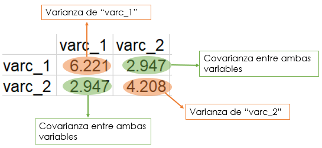
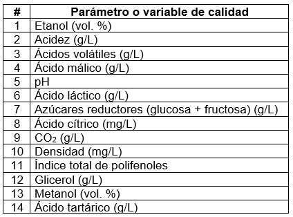
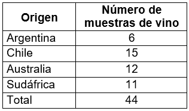
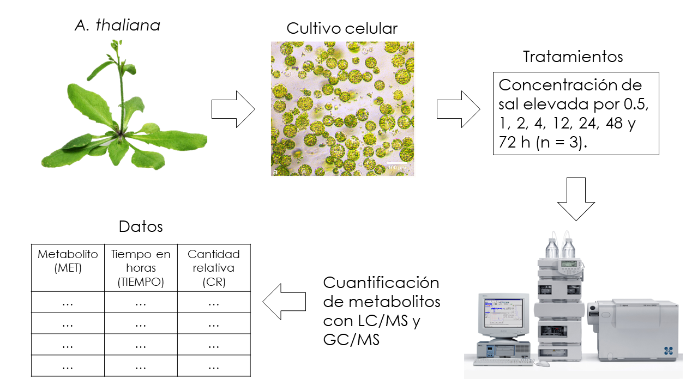

--- 
title: "Análisis de Componentes Principales paso a paso con R"
author: "Juan Pablo Carreón Hidalgo"
date: "`r Sys.Date()`"
site: bookdown::bookdown_site
documentclass: book
# url: your book url like https://bookdown.org/yihui/bookdown
cover-image: "imagenes/cover.jpg"
---

# Acerca de este manual

Este documento es una guía de cómo realizar análisis de componentes principales (*PCA*, por sus siglas en inglés) con R y R Studio. Incluye una pequeña introducción al álgebra lineal, se expone el caso más simple de *PCA* en dos dimensiones y posteriormente se generaliza a más de tres dimensiones. También se expone un ejemplo aplicado al área de metabolómica y como un pequeño extra se aborda cómo realizar y desplegar una Shiny App que nos permita realizar *PCA* de manera automática.  

Los capítulos en este manual son básicamente traducciones y adaptaciones de las publicaciones originales en mi blog <a href="https://r-inthelab.net/" target="_blank">*R in the lab*</a>. Al igual que en mi blog, todo el contenido de este manual en su versión online está bajo licencia [Creative Commons Attribution 4.0 International License][cc-by]. Lo anterior implica que las personas que accedan a este manual pueden copiar, modificar y usar el texto, el código y las figuras con cualquier fin, siempre y cuando se haga la adecuada mención a la publicación original. Personalmente, no creo exista una mejor manera de compartir conocimiento y contribuir a la creación y difusión del mismo que publicarlo bajo licencias como *Creative Commons* o similares.  

## Un poco del autor

Me gustaría resaltar que yo, el autor de este manual, no me especializo ni me dedico formalmente a la ciencia de datos, por lo que posiblemente el contenido de esta publicación no estará libre de omisiones o errores. Lo que sí puedo afirmar es que llevó unos siete años utilizando *R* y *R Studio* y también, a lo largo de todo este tiempo, he aprendido a utilizar diversas herramientas relacionadas con el análisis de datos y otras como la creación de *Shiny Apps* y blogs. Este es mi primer intento de realizar una publicación tipo manual con la ayuda del paquete *bookdown*. Me considero alguien autodidacta y sé bien que el conocimiento solo se puede asimilar realmente al compartir eso que acabas de aprender. Este manual y todas mis publicaciones son un intento por compartir y contribuir a mi comunidad. Donde quiera que estés y quienquiera que seas espero todo lo abordado en cada capítulo te sea de utilidad y te contagié un poco de mi pasión por aprender. ¡Ojalá lea algo tuyo muy pronto, no dudes en compartirlo!   

Por favor, si detectas cualquier tipo de error o tienes cualquier tipo de duda contáctame a través de mi correo electrónico (jpch_26@outlook.com) o facebook (https://www.facebook.com/jpch26). También puedo echarte una mano con tu aprendizaje de R y R Studio 😉. 

Ya por último, si está dentro de tus posibilidades, considera invitarme un cafecito a través de mi página de ko-fi ☕: <a href="https://ko-fi.com/juanpach" target="_blank">Ko-fi de JPCH</a>. ¡Muchas gracias!

[cc-by]: http://creativecommons.org/licenses/by/4.0/

<!--chapter:end:index.Rmd-->

# Algunas operaciones básicas de álgebra lineal 

En este capítulo cubriré algunas operaciones de álgebra lineal. Esto será suficiente para posteriormente abordar el análisis de componentes principales desde sus bases en el álgebra lineal. Si la momento de leer este capítulo no tienes mucha o ninguna experiencia con esta rama de las matemáticas, te recomiendo publicaciones como *Nociones de geometría analítica y álgebra lineal* o canales en *YouTube* como *3Blue1Brown* (solo en inglés, pero con subtítulos en español).  

## Operaciones con vectores

### Crear vectores 

En *R* podemos definir vectores numérico de manera muy sencilla con la función `c()`. 

```{r define vectores}
x <- c(30, 20, 40, 10)
y <- c(20, 15, 18, 40)
```

### Suma de vectores

Para sumar un par de vectores utilizamos el operador `+` de la manera usual. Nota que cada elemento en el vector `x` se suma con el elemento en la misma posición en el vector `y`.

```{r suma x y}
x + y
```

En *R*, si intentamos sumar vectores con una longitud distinta, los elementos del vector más pequeño se reciclan para corresponder con el número de elementos del vector de mayor longitud. Esto se ve más claramente al realizar la operación en la consola de *R*.

```{r suma vectores distinta longitud}
# Vector con dos elementos
v2 <- c(10, 40)

x + v2
```

El vector `v2` se utilizó dos veces de la forma `c(10, 40, 10, 40)` para corresponder con los elementos de `x`. Si el vector más largo tiene un número de elementos que no es un múltiplo del número de elementos del vector más pequeño, *R* desplegará un mensaje de advertencia.  

```{r suma vector impar}
# Vector con tres elementos
v3 <- c(10, 40, 15)

x + v3
```

Esto es un recordatorio de que al intentar reutilizar los elementos del vector más pequeño, algunos serán omitidos. En el ejemplo anterior, los elementos de `v3` se utilizaron de la forma `c(10, 40, 15, 10)` para corresponder con la longitud de `x`.  

### Multiplicación de un vector por un escalar

Para multiplicar un vector por un escalar (un solo número) utilizamos el operador `*`.  

```{r multiplicación por un escalar}
100 * x
```

Aquí cada elemento en `x` se multiplicó por nuestro escalar `100`.  

### Producto punto o producto interno

Para obtener el producto interno o producto punto de dos vectores, utilizamos el operador `%*%`.  

```{r producto punto}
z <- x %*% y
z
```

Esta operación devuelve un objeto de las clases matriz y arreglo o `matrix` y `array` en inglés.  

```{r z como matriz}
class(z)
```

Para obtener solo el valor numérico, utilizamos la función `as.numeric()`.  

```{r z como número}
as.numeric(z)
```

De manera un poco extendida o desglosada, al realizar el producto punto entre dos vectores cada elemento en el vector `x` se multiplica por el elemento en la misma posición en el vector `y` y posteriormente cada producto se suma para obtener el total. En la consola de *R* lo anterior podría definirse de la siguiente forma.  

```{r producto desglosado}
# Vectores "x" y "y"
x <- c(30, 20, 40, 10)
y <- c(20, 15, 18, 40)

# Producto punto desglosado
30*20 + 20*15 + 40*18 + 10*40
```

También debemos resaltar que los vectores deben tener el mismo número de elementos. De otra forma *R* nos mostrará un mensaje de error. 

```{r producto distintas longitudes, error=TRUE}
x %*% v2
```

### Norma o magnitud de un vector

Para obtener la magnitud o *norma* de una vector podemos obtener la raíz cuadrada del producto punto del vector en cuestión por sí mismo.  

```{r norma con operaciones}
sqrt(x %*% x)
```

También podemos utilizar la función `norm()`, pero primero debemos asegurarnos que nuestro vector posea la clase matriz.  

```{r funcion norm}
x_m <- as.matrix(x)

norm(x_m, type = "F")
```

## Operaciones con matrices

### Definir matrices

Para definir una matriz en *R* usamos la función `matrix()` con un vector numérico como argumento.

```{r definir una matriz}
# Define un vector numérico
v_n <- c(7, -6, 12, 8)

# Define la matriz
m <- matrix(
  v_n,
  nrow = 2,     # Número de renglones en nuestra matriz
  byrow = TRUE, # Ordenar cada elemento por renglón
)

m
```

Si el argumento `byrow` se establece como falso (`FALSE`), los elementos se ordenarán por columna.

```{r ordenar por columna}
matrix(v_n, nrow = 2, byrow = FALSE)
```

### Multiplicar una matriz por un vector

Para multiplicar una matriz por un vector utilizamos el operador `%*%`. Debemos cuidar que el número de elemento del vector sea igual al número de columnas en nuestra matriz.  

```{r matriz 2}
# Define una matriz
m2 <- matrix(
  c(8, 4, 5, 3, 1, 2),
  nrow = 3,
  byrow = TRUE
)

m2
```

```{r vector por una matriz}
# Define un vector
z <- c(3, 4)

# Multiplica usando %*%
m2 %*% z
```

Como puede verse, el resultado es un *vector columna* que no es otra cosa que un objeto de la clase matriz con una sola columna. Al realizar este tipo de multiplicación debemos recordar que el orden del producto sí importa, tanto para la multiplicación de un vector por una matriz como para el producto entre matrices. Esto lo veremos con un poco de detalle más adelante.  

Para calcular cada elemento en el vector que obtuvimos en el ejemplo anterior, tomamos cada renglón de la matriz y realizamos el producto punto con el vector `z`.    

```{r vector por matriz desglosado}
# Primer renglón de la matriz
r1 <- c(8, 4)

# Segundo renglón
r2 <- c(5, 3)

# Tercer renglón
r3 <- c(1, 2)

# Elementos en el vector columna resultante
cat("Primer elemento:", r1 %*% z, "\n")
cat("Segundo elemento:", r2 %*% z, "\n")
cat("Tercer elemento:", r3 %*% z)
```

### Multiplicación de matrices

Para multiplicar dos matrices utilizamos el operador `%*%`. También debemos asegurarnos de que el número de columnas en la primera matriz sea igual número de renglones en la segunda.  

```{r definir matrices}
# Una matriz de dos renglones y tres columnas (2 X 3)
A <- matrix(c(1, 2, 3, 4, 0, 1), nrow = 2, byrow = TRUE)

# Una matriz de tres renglones y tres columnas (3 X 3)
B <- matrix(c(1, 1, 0, 0, 1, 1, 1, 0, 1), nrow = 3, byrow = TRUE)

# Producto de ambas matrices
A %*% B
```

De manera desglosada, cada elemento en la matriz resultante se calculó realizando el producto punto entre cada renglón de la matriz `A` y por cada columna de la matriz `B`. Por ejemplo, calculemos el primer elemento, el número 4, en el resultado anterior. 

```{r primer elemento de la matriz}
# Primer renglón de la matriz A
ar_1 <- c(1, 2, 3)

# Primera columna de la matriz B
bc_1 <- c(1, 0, 1)

# Producto punto entre ambos vectores
ar_1 %*% bc_1
```

Lo anterior se repite para obtener cada elemento de la matriz resultante. De manera general si la primera matriz tiene *a* renglones y *b* columnas (una matriz *a X b*) y la segunda matriz tiene *b* columnas y *c* renglones (una matriz *b X c*), la matriz que obtengamos de la multiplicación de ambas matrices tendrá *a* renglones y *c* columnas (una matriz *a X c*).   

Pare terminar esta sección, retomemos lo que mencioné anteriormente, el orden de los factores en la multiplicación de matrices si altera el resultado. Esto se puede demostrar fácilmente definiendo un par de matrices de 2 X 2 (dos renglones y dos columnas).  

```{r matrices 2x2}
C <- matrix(c(2, 4, 6, 0), nrow = 2)
D <- matrix(c(1, 3, 0, 9), nrow = 2)
```

La multiplicación `C %*% D`:  

```{r C x D}
C %*% D
```

La multiplicación `D %*% C`:  

```{r D %*% C} 
D %*% C
```

### Multiplicación de un escalar por una matriz

La multiplicación de un escalar por una matriz se hace de la misma forma que para vectores.  

```{r escalar por matriz}
100 * A
```

### Transpuesta de una matriz

Para obtener la *transpuesta* de una matriz usamos la función `t()`.  Esta operación solo "intercambia" los renglones y columnas en la matriz original. Cada renglón pasa a ser una columna o viceversa, cada columna pasa a ser un renglón.  

Matriz original:  

```{r matriz A}
A
```

Matriz transpuesta:  

```{r transpuesta}
t(A)
```

### Matriz identidad

En ocasiones puede ser útil definir una matriz *identidad* o *diagonal*, para esto utilizamos la función `diag()`.   

```{r matriz identidad}
I <- diag(nrow = 5)
I
```

Como puede observarse, la matriz identidad tiene el mismo número de renglones y columnas y todos los elementos en la diagonal son 1.  

### Valores y vectores propios de una matriz

La obtención de los valores y vectores propios de una matriz resulta una operación central al realizar análisis de componentes principales.  

De manera muy general, podemos pensar en una matriz como una función que puede modificar la dirección y magnitud de un vector o vectores dados. Por ejemplo, si definimos una matriz con dos columnas y dos renglones, esta podrá multiplicarse por vectores de dos elementos. Dichos vectores, a excepción del vector (0, 0), verán modificada su dirección y posiblemente su magnitud dependiendo de los elementos de la matriz.

```{r modificación de un vector por una matriz}
M  <- matrix(c(4, 0, 1, -1), nrow = 2, byrow = TRUE)
v4 <- c(3, 4)

v4 %*% M
```

En el ejemplo anterior, el vector resultante tiene coordenadas o elementos distintos, y si obtenemos la norma o magnitud de ambos vectores en este caso también resultarán en valores distintos.  

Ahora bien, un *vector propio* no verá modificada su dirección al multiplicarse por una matriz y en cuanto a su magnitud, esta podrá aumentar o disminuir por una constante o constantes dadas. Dichas constantes son los *valores propios*. Entonces, para resumir o decirlo de otra manera, los vectores propios son una especie de ejes que permanecen inmóviles al multiplicarse por un matriz y estos solo se estiran o contraen dependiendo de los valores propios.   

En *R* para obtener los vectores y valores propios de una matriz, utilizamos la función `eigen()`. Para nuestro ejemplo, definamos una matriz pequeña de dos renglones y dos columnas.

```{r matriz de 2x2 para eigen}
A <- matrix(c(3, 4, 0, 5), nrow = 2, byrow = TRUE)
A
```

Al utilizar la función `eigen()`, esta devolverá un listado con los vectores y valores propios.  

```{r vectores y valores propios}
eA <- eigen(A) 
```

Para acceder a los elementos de este listados utilizamos el operador `$`. Primero guardemos los valores propios en otro objeto.  

```{r valores propios}
eA_vls <- eA$values
eA_vls
```

Después hacemos lo mismo para los vectores.  

```{r vectores propios}
eA_vcs <- eA$vectors
eA_vcs
```

En esta matriz cada columna es un vector propio. Entonces, si tomamos el segundo vector propio y los multiplicamos por el segundo valor propio, veremos que el vector apunto al mismo lugar, pero tendrá una longitud mayor.  

```{r segundo vector propio por valor propio}
eA_vls[2] %*% eA_vcs[, 2]
```

## Algunos extra

Para terminar con este capítulo, a continuación muestro algunas procedimientos que pueden ser de utilidad para el lector. Claro, utilizando operaciones de álgebra lineal.  

### Resolver sistemas de ecuaciones lineales

Digamos que queremos resolver el siguiente sistema de ecuaciones lineales con ayuda de *R*:  

$a + b + c = 15$  
$3a + 2b + c = 28$  
$2a + b + 2c = 23$  

En primer lugar, definimos una matriz con los coeficientes del sistema y un vector con los resultados o constantes de cada ecuación.  

En el caso de los coeficientes, cada renglón corresponderá a una ecuación y cada elemento corresponderá a un término, ya sea *a*, *b* o *c*. El orden de los coeficientes en cada renglón debe ser el mismo, en este caso se sigue el orden por abecedario.  

```{r matriz de coeficientes}
MC <- matrix(c(1, 1, 1, 3, 2, 1, 2, 1, 2), nrow = 3, byrow = TRUE)
MC
```

Para el vector de constantes también seguimos el orden por ecuación.  

```{r vector de constante}
vc <- c(15, 28, 23)
vc
```

El siguiente paso es obtener la *inversa* de la matriz de coeficientes. Para esto usamos a la función `solve()`.  

```{r inversa de MC}
MC_inv <- solve(MC)
MC_inv
```

Y finalmente, para obtener la solución, multiplicamos la inversa por el vector de coeficientes.  

```{r solucion del sistema}
sv <- MC_inv %*% vc
sv
```

Entonces *a = 3*, *b = 7* y *c = 5*. Para verificar nuestra solución, podemos multiplicar *sv* por la matriz de coeficientes original (*MC*), lo que dará como resultado al vector de constantes (*vc*).  

```{r verificar solucion}
MC %*% sv
```

### Promedio y varianza con operaciones de álgebra lineal

El álgebra lineal es fundamental y es utilizada para simplificar operaciones y reducir tiempos de computación. Muchas funciones y procedimientos estadísticos tienen en su centro operaciones de álgebra lineal.  

#### Promedio

Para calcular el promedio, primero simulemos un conjunto de 100 datos. La función `set.seed()` se utiliza para asegurar que cada vez que ejecutemos el mismo ejemplo obtengamos el mismo conjunto de datos.  

```{r simular cien datos}
set.seed(5)
vd <- runif(100, min = 10, max = 35)
```

Para obtener el promedio, necesitamos obtener la longitud del vector anterior y definir un vector de la misma longitud que solo contenga unos.  

```{r longitud y vector con unos}
# Longitud (número de elementos) del vector vd
ld <- length(vd) 

# Vector con 1's 
v1 <- rep(1, ld)
```

Multiplicamos el vector con nuestros datos por el vector de unos, lo que resultará en la suma de todos los datos, y dividimos por la longitud del vector.  

```{r media con álgebra}
vd_promedio <- v1 %*% vd / ld
vd_promedio
```

Si utilizamos la función `mean()` con el vector *vd* como argumento obtendremos el mismo resultado.  

```{r promedio con mean}
mean(vd)
```

### Varianza  

Para calcular la varianza del mismo conjunto de datos, primero obtenemos la diferencia entre cada dato y el promedio.  

```{r diferencias}
d <- vd - as.numeric(vd_promedio)
```

Multiplicamos el vector de diferencias por sí mismo, lo que dará como resultado la suma de las diferencias al cuadrado, y dividimos entre el número de datos menos uno (los grados de libertad).  

```{r varianza con álgebra lineal}
vd_varianza <- d %*% d / ld - 1
vd_varianza
```

Si utilizamos la función `var()` obtendremos el mismo resultado.  

```{r varianza con var}
var(vd)
```


<!--chapter:end:01-algebra-lineal.Rmd-->

# Análisis de componentes principales en dos dimensiones

Es hora de abordar el tema principal de este manual. Por simpleza, de aquí en adelante abreviaré el nombre de "análisis de componentes principales" como *PCA* por sus siglas en inglés.   

El *PCA* es un análisis exploratorio de datos basado en la reducción de dimensiones. La idea general es reducir el conjunto de datos para que tenga menos dimensiones y, al mismo tiempo, conservar la mayor cantidad de información posible.  

El *PCA* nos permite hacer representaciones visuales en dos dimensiones y comprobar si hay grupos o diferencias en los datos relacionados con diferentes estados, tratamientos, etc. Además, podemos obtener alguna pista sobre qué variables en los datos son responsables de las diferencias visuales.  

Es importante destacar que el *PCA* no se utiliza exclusivamente para lo anterior y como es un análisis exploratorio las similitudes o diferencias de los datos deben ser consideradas en el contexto del que provienen.  

Comencemos con un caso simple que nos ayudará a comprender el *PCA*. Utilizaré solo dos variables para mostrar algunos conceptos básicos detrás de PCA. Luego, podremos generalizar a datos con más dimensiones.  

## Datos

Para la primera variable tomé como base una distribución normal, y para la segunda consideré cierto grado de dependencia con la primera y añadí un poco ruido también con una distribución normal.  

```{r datos}
set.seed(1)

# Variable 1
var_1 <- rnorm(50, 50, sd = 3)

# Variable 2
var_2 <- .5*var_1 + rnorm(50, sd = sqrt(3))

# Ambas variables en un "data.frame"
datos_1 <- data.frame(var_1, var_2)

head(datos_1)
```
Un gráfico de dispersión puede mostrar la dispersión y la posible relación entre ambas variables:  

```{r grafica var_1 y var_2}
library(ggplot2)

# A scatter plot with the two simulated variables
ggplot(datos_1, aes(x = var_1, y = var_2)) +
  geom_point(color = "blue", size = 2) +
  xlab("Variable 1") +
  ylab("Variable 2") +
  theme_classic()
```

## Centrar los datos

El primer paso del *PCA* es centrar las dos variables respecto a su media.  

```{r centrar los datos, message=FALSE, warning=FALSE}
library(dplyr)

datos_1 <- datos_1 %>% 
  mutate(varc_1 = var_1 - mean(var_1), varc_2 = var_2 - mean(var_2))

head(datos_1)
```

Tenga en cuenta que lo anterior no modifica la posición relativa entre cada punto, por lo que los datos centrados tienen el mismo aspecto.  

```{r dispersion variables centradas}
ggplot(datos_1, aes(x = varc_1, y = varc_2)) +
  geom_point(color = "blue", size = 2) +
  geom_vline(xintercept = 0, size = .5) +
  geom_hline(yintercept = 0, size = .5) +
  xlab("Variable 1 (valores centrados)") +
  ylab("Variable 2 (valores centrados)") +
  theme_classic()
```

## Calcular la matriz de covarianza

Se puede calcular la *matriz de covarianza* para un conjunto dado de variables simplemente realizando una multiplicación de matrices en los datos centrados.  

```{r matriz de covarianza}
# Seleccionar las variables centradas
datos_2 <- datos_1 %>% 
  select(varc_1, varc_2) %>% 
  as.matrix()

# Calcular la matriz de covarianza
cov_m <- (t(datos_2) %*% datos_2) / (nrow(datos_2) - 1) 

cov_m
```

En esta matriz, la diagonal contiene las varianzas de cada variable, mientras que los valores fuera de la diagonal son las covarianzas entre ellas (véase la figura siguiente).  

```{r fig matriz covarianza, echo=FALSE, fig.align='center'}

```

El mismo resultado se puede obtener con la función `cov()`.  

```{r matriz con funcion cov}
cov(datos_2)
```

O también con la función `crossprod()` de la siguiente forma.  

```{r matriz con funcion crossprod}
crossprod(datos_2) / (nrow(datos_2) - 1)
```

## Obtener los valores y vectores propios de la matriz de covarianza

Los *componentes principales* representan las direcciones en los datos que explican la máxima cantidad de variación. Son "líneas" que capturan la mayor parte de la información en los datos. Estas direcciones pueden obtenerse calculando los valores y vectores propios de la matriz de covarianza.  

```{r valores y vectores propios}
# Función eigen() para obtener los vectores y valores propios
cov_e <- eigen(cov_m)

# Vectores propios
e_vec <- cov_e$vectors

# Valores propios
e_val <- cov_e$values
```

La extensión de cada vector propio (*span* en inglés) puede considerarse la "línea" que capta la mayor parte de la variación.  

```{r representación de los vectores propios}
# Primer vector propio 
ev_1 <- e_vec[,1]

# Pendiente del primer vector propio
ev1_m <- ev_1[2] / ev_1[1]

# Segundo vector propio 
ev_2 <- e_vec[,2]

# Pendiente del segundo vector propio
ev2_m <- ev_2[2] / ev_2[1]

# Gráfica de dispersión de los datos centrados mostrando la extensión de
# cada vector propio
ggplot(data.frame(datos_2), aes(x = varc_1, y = varc_2)) +
  geom_point(color = "blue", size = 2) +
  geom_vline(xintercept = 0, size = .5) +
  geom_hline(yintercept = 0, size = .5) +
  geom_abline(slope = ev1_m, color = "blue", size = 0.7) +
  geom_abline(slope = ev2_m, color = "red", size = 0.7) +
  xlab("Variable 1 (valores centrados)") +
  ylab("Variable 2 (valores centrados)") +
  theme_classic()
```
## Gráfica de barras para la varianza de cada componente principal

Al dividir cada valor propio por *n - 1*, donde *n* es el número de renglones en los datos originales, obtendremos una estimación de la varianza de cada componente principal. La suma de todas las varianzas (la varianza total) puede utilizarse para calcular el porcentaje de variación de cada componente y, finalmente, podemos visualizar los porcentajes con una gráfica de barras (en inglés a esta gráfica se le conoce como *Scree plot*).  

```{r scree plot}
# Calcular la varianza estimada para cada valor propio
e_var <- e_val / (nrow(datos_2) - 1)

# "Data frame" con los porcentajes de variación
var_per <- data.frame(
  PC  = c("PC1", "PC2"),
  PER = c(e_var) * 100 / sum(e_var) # Calcular los porcentajes
)

# "Scree plot" 
ggplot(var_per, aes(x = PC, y = PER)) +
  geom_col(width = 0.5, color = "black") +
  xlab("Componente principal") +
  ylab("Porcentaje de variación (%)") +
  theme_classic()
```

## Pesos (Loading scores)

Los vectores propios obtenidos mediante la función `eigen()` están normalizados. Esto quiere decir que su longitud es igual a 1.  

```{r normas de los vectores propios}
# Norma del primer vector propio
norm(as.matrix(ev_1), "F")

# Norma del segundo vector propio
norm(as.matrix(ev_2), "F")
```

Los elementos de cada vector propio también se denominan *pesos* (*loadings* en inglés) y pueden interpretarse como la contribución de cada variable en los datos originales a un componente principal en específico, o, más estrictamente, se pueden interpretar como los coeficientes de la combinación lineal de las variables originales a partir de las cuales se construyen los componentes principales.  

Puedes realizar una tabla con estos valores y observar las contribuciones de cada variable a cada componente principal.  

```{r tabla con pesos}
# "Data frame" con ambos valores propios
loads <- data.frame(
  VAR   = c("var_1", "var_2"),
  PC1 = ev_1, # Primer vector propio
  PC2 = ev_2  # Segundo vector propio
)

loads
```
Lo anterior puede ser útil en datos con muchas dimensiones para establecer qué variables son las causantes de las agrupaciones o diferencias en las gráficas de dispersión del *PCA*.  

## Representar los datos en menos dimensiones

Cambiar la base de los datos originales por la indicada por los vectores propios, producirá una "rotación" de los datos.  

```{r rotacion de los datos originales}
# Inversa de la matriz con los vectores propios
inv_evec <- solve(e_vec) 

# Cambio de base de los datos originales
datos_3 <- datos_2 %*% inv_evec

# Gráfica de dispersión donce se muestra la dispersión
ggplot(data.frame(datos_3), aes(X1, X2)) +
  geom_point(color = "blue", size = 2) +
  geom_vline(xintercept = 0, size = .5) +
  geom_hline(yintercept = 0, size = .5) +
  xlab("PC1 (78.8%)") +
  ylab("PC2 (21.2%)") +
  theme_classic()
```

Podemos comparar la gráfica anterior con la de los datos originales para tener una idea más clara de como se rotaron los datos una vez que cambiamos su base.  

```{r comparar rotacion}
library(ggpubr)

# Gráfica de dispersión con los datos centrados 
dg <- ggplot(data.frame(datos_2), aes(varc_1, varc_2)) +
  geom_point(color = "blue", size = 2) +
  geom_vline(xintercept = 0, size = .5) +
  geom_hline(yintercept = 0, size = .5) +
  ylim(c(-8, 8.5)) +
  ggtitle("Datos originales (Centrados)") +
  theme_classic()

# Scatter plot with the rotated data
dr <- ggplot(data.frame(datos_3), aes(X1, X2)) +
  geom_point(color = "blue", size = 2) +
  geom_vline(xintercept = 0, size = .5) +
  geom_hline(yintercept = 0, size = .5) +
  xlab("PC1 (78.8%)") +
  ylab("PC2 (21.2%)") +
  ylim(c(-8, 8.5)) +
  ggtitle("Cambio de base") +
  theme_classic()

# Both graphs side by side
ggarrange(dg, dr)
```

Ya que el componente principal 1 (*PC1*) explica la mayor parte de la variación en los datos, podemos omitir el componente principal 2 (*PC2*) y representar cada punto en una sola dimensión. A continuación represento los datos en una sola dimensión con puntos rojos.  

```{r datos en una sola dimensión}
# Datos del componente principal 1
datos_pc1 <- data.frame(v1 = datos_3[,1], v2 = rep(0, nrow(datos_3)))

# Gráfica de dispersión mostrando los datos de PC1
ggplot(data.frame(datos_3), aes(X1, X2)) +
  geom_point(color = "blue", size = 2) +
  geom_point(data = datos_pc1, aes(v1, v2), color = "red", size = 2) +
  geom_vline(xintercept = 0, size = .5) +
  geom_hline(yintercept = 0, size = .5) +
  xlab("PC1 (78.8%)") +
  ylab("PC2 (21.2%)") +
  ylim(c(-8, 8.5)) +
  theme_classic()
```

Las ideas anteriores pueden utilizarse en datos con muchas variables para reducir las dimensiones y representar los datos con gráficos de dispersión en dos dimensiones.  

<!--chapter:end:02-PCA-2-dimensiones.Rmd-->

# Genaralización del PCA a más de tres dimensiones

Las ideas expuestas en capítulo anterior se pueden generalizar a datos con más de tres dimensiones. En este capítulo usaremos datos reales de distintos vinos provenientes de distintos países. Todos los datos pueden encontrarse en el repositorio de este libro [incluir link] en la carpeta "datos".

## Datos

En las muestras de vino se midieron las siguientes variables o parámetros de calidad.  

```{r variables vino, fig.align='center', echo=FALSE}

```

Las muestras de vino proceden de Argentina, Chile, Australia y Sudáfrica.  

```{r origen vino, fig.align='center', echo=FALSE}

```
Las seis primeras filas del conjunto de datos tienen este aspecto.  

```{r datos vino}
# Nombres de las variables o parámetro de calidad
nombres_var <- read.csv("datos/Label_Pred_values_IR.csv")
nombres_var <- names(nombres_var)

# Etiquetas o códigos en las muestras de vino
cod_vino <- read.csv("datos/Label_Wine_samples.csv", header = FALSE)
cod_vino <- unname(unlist(cod_vino))

# Conjunto de datos completo para las muestras de vino
datos_vino <- read.csv(
  "datos/Pred_values.csv", header = FALSE,
  row.names = cod_vino, col.names = nombres_var
  )

head(datos_vino)
```
En este conjunto de datos las muestras de vino están marcadas como los nombres de las filas, y cada muestra tiene asociados los valores de cada parámetro de calidad (columnas de datos). Es importante prestar atención a la información señalada en columnas y renglones al calcular las matrices de covarianza o utilizar funciones para realizar el *PCA*, ¿quiere reducir las dimensiones con respecto a las filas o con respecto a las columnas? Aquí nos interesa reducir el número de dimensiones con respecto a los parámetros y tratar de detectar si hay algunas similitudes o diferencias entre las muestras de vino.  

## Centrar cada variable y dividir por su desviación estándar

Primero restamos el promedio de cada variable (columnas) y dividimos el resultado entre la desviación estándar.  

```{r centrar los datos y dividir por sd}
library(purrr)

# Promedios de cada variable
prom_vars <- unlist(map(datos_vino, mean))

# Desviación estándar de cada variable
de_vars <- unlist(map(datos_vino, sd))

# Centrar cada variable
datos_vino_2 <- map2(
  datos_vino, prom_vars, .f = function(x, mean) x - mean
  )

# Dividir por la desviación estándar de cada variable
datos_vino_2 <- map2(
  datos_vino_2, de_vars, .f = function(x, sd) x / sd
)

# Generar una matriz a partir de la lista anterior
datos_vino_2 <- as.matrix(data.frame(datos_vino_2))
```

Cada renglón de los datos transformados corresponde a la misma muestra de vino que en los datos originales.  

Los primeros seis renglones de los datos transformados tienen el siguiente aspecto.  

```{r datos tranformados}
head(datos_vino_2)
```
Dividir por las desviaciones estándar es una forma de dar a cada variable la misma importancia a pesar de su rango, magnitud y/o escala de medición. Además de dividir por la desviación estándar, son posibles otras transformaciones que pueden aplicarse en función de los datos. Consulte los referencias al final de este manual si está interesado.  

## Calcular la matriz de covarianzas

Para obtener la matriz de covarianzas multiplicamos los datos (como una matriz) por su traspuesta y dividimos por el número de renglones menos uno (los grados de libertad).  

```{r matriz covarianza}
# Calcular la matriz de covarianzas
vino_cov <- (t(datos_vino_2) %*% datos_vino_2) / 
  (nrow(datos_vino_2) - 1)

vino_cov[1:5, 1:5]
```
Aquí sólo te muestro las cinco primeras filas y columnas de la matriz de covarianza. Si estás utilizando *R Studio*, puedes usar la función `View()` para desplegar una ventana completa que mostrará los datos de tu elección. 

En la matriz anterior, los valores en la diagonal son las varianzas de cada variable y los valores fuera de la diagonal son las *covarianzas* entre las variables. Como puede observarse, todas las varianzas son iguales a 1. Esto es precisamente el efecto de centrar y dividir por la desviación estándar de cada variable.  

## Obtener los valores y vectores propios de la matriz de covarianzas  

Para obtener los valores y vectores propios usamos la función `eigen()`.  

```{r valores y vectores propios}
vino_eg <- eigen(vino_cov)

# Valores propios
val_eg <- vino_eg$values

# Vectores propios
vec_eg <- vino_eg$vectors
```

El número de vectores y valores propios es el mismo que el número de variables en el conjunto de datos originales.  

```{r numero de valores y vectores propios}
# Número de valores propios
length(val_eg)

# Número de vectores propios
ncol(vec_eg)
```

## Gráfica de barras para la varianza de cada componente principal

Ahora calculamos el porcentaje de variación de cada componente y realizamos una gráfica de barras.  

```{r scree plot}
# Calcular la varianza de cada valor propio
vars_val_eg <- val_eg / (nrow(datos_vino_2) - 1)

# "Data frame" con los porcentajes de variación
vars_perc <- data.frame(
  PC  = unlist(map(1:14, function(x) paste0("PC", x))),
  PER = round((vars_val_eg * 100) / sum(vars_val_eg), 4)
    )

# Gráfica de barras
library(ggplot2)

ggplot(
  vars_perc, 
  aes(x = reorder(PC, order(PER, decreasing = TRUE)), y = PER)
       ) +
  geom_col(width = 0.5, color = "black") +
  xlab("Componente Principal") +
  ylab("Porcentaje de variación (%)") +
  theme_classic()
```
## Representar los datos en dos dimensiones 

Idealmente, si PC1 y PC2 reunieran la mayor parte de la variación, digamos más del 90%, sería posible hacer una buena representación de los datos en una gráfica de dispersión en dos dimensiones. Ya que la mayor parte del tiempo los datos reales nunca son ideales, para los datos de vino PC1, PC2, PC3 y PC4 representan el 73% de la variación. En estos casos podemos tratar de detectar grupos haciendo dos gráficos de dispersión, el primero con PC1 y PC2, y el segundo con PC3 y PC4.  

En primer lugar, cambiamos la base de los datos transformados por la indicada por los vectores propios.  

```{r cambio de base, message=FALSE, warning=FALSE} 
library(dplyr)

# Cambiar la base de los datos centrados 
datos_vino_cb <- datos_vino_2 %*% solve(vec_eg)

# Transformar a un "data frame"
datos_vino_cb <- data.frame(datos_vino_cb)
colnames(datos_vino_cb) <- vars_perc$PC

# Añadir una columna con los datos de origen de cada muestra de vino
datos_vino_cb <- datos_vino_cb %>% 
  mutate(
    MuestraVino = unlist(map(cod_vino, function(x) substr(x, 1, 3)))
    ) %>% 
  relocate(MuestraVino)

head(datos_vino_cb)
```

Ahora hagamos ambas gráficas de dispersión tomando los valores de PC1, PC2, PC3 y PC4.  

```{r graficas con PC1, PC2, PC2 y PC4}
library(ggpubr)

# Gráfica de dispersión para PC1 y PC2
pc12 <- ggplot(
  datos_vino_cb, 
  aes(PC1, PC2, color = MuestraVino, shape = MuestraVino)
) +
  geom_point(size = 3) +
  ggtitle("PC1 y PC2") +
  xlab("PC1 (24.4%)") +
  ylab("PC2 (21.3%)") +
  theme_classic() +
  theme(legend.position = "none") 

# Gráfica de dispersión para PC3 y PC4
pc34 <- ggplot(
  datos_vino_cb, 
  aes(PC3, PC4, color = MuestraVino, shape = MuestraVino)
) +
  geom_point(size = 3) +
  scale_color_discrete(
    name = "País de origen", 
    labels = c("Argentina", "Australia", "Chile", "Sudáfrica")
    ) +
  scale_shape_discrete(
    name = "País de origen", 
    labels = c("Argentina", "Australia", "Chile", "Sudáfrica")
  ) +
  ggtitle("PC3 y PC4") +
  xlab("PC3 (17.5%)") +
  ylab("PC4 (10.0%)") +
  theme_classic()

# Both graphs side by side
ggarrange(pc12, pc34, widths = c(1.5, 2))
```
## Pesos (Loading scores)

Los elementos de cada vector propio representan el peso de cada variable en el componente principal correspondiente.  

```{r pesos vino}
# "Data frame" con los pesos
pesos_vino <- data.frame(vec_eg)
colnames(pesos_vino) <- vars_perc$PC
rownames(pesos_vino) <- nombres_var

head(pesos_vino)
```

Hacer una gráfica de dispersión con estos valores puede ayudar a ver patrones de variación y/o explicar las agrupaciones o diferencias en las gráficas de dispersión de los componentes principales.  

```{r grafica de pesos}
# Dispersión con pesos de PC1 y PC2
ld_pc12 <- ggplot(pesos_vino, aes(PC1, PC2)) +
  geom_point(color = "blue", size = 2) +
  geom_vline(xintercept = 0) +
  geom_hline(yintercept = 0) +
  geom_text(aes(label = rownames(pesos_vino)), hjust = -.2) +
  ggtitle("Pesos para PC1 y PC2") +
  xlim(c(-.7, .7)) +
  ylim(c(-.7, .7)) +
  xlab("PC1 (24.4%)") +
  ylab("PC2 (21.3%)") +
  theme_classic()

# Dispersión con pesos de PC3 y PC4
ld_pc34 <- ggplot(pesos_vino, aes(PC3, PC4)) +
  geom_point(color = "blue", size = 2) +
  geom_vline(xintercept = 0) +
  geom_hline(yintercept = 0) +
  geom_text(aes(label = rownames(pesos_vino)), hjust = -.2) +
  ggtitle("Pesos para PC3 y PC4") +
  xlim(c(-.7, .7)) +
  ylim(c(-.7, .7)) +
  xlab("PC3 (17.5%)") +
  ylab("PC4 (10.0%)") +
  theme_classic()

# Ambas gráficas lado a lado
ggarrange(ld_pc12, ld_pc34)  
```
En el siguiente capítulo abordaremos como realizar *PCA* con funciones específicas para este análisis e incluidas en *R*.

<!--chapter:end:03-PCA-generalizacion.Rmd-->

# Análisis de componentes principales con descomposición de valores singulares

En este capítulo mostraré como llevar a cabo *PCA* con funciones específicas para esta tarea en *R*. Esto nos ayudará a simplificar los pasos cada vez que necesitemos llevar a cabo este análisis.  

## Descomposición de valores singulares

La descomposición de valores singulares (*SVD* por sus siglas en inglés) es una factorización que generaliza la obtención de valores y vectores propios en matrices cuadradas (mismo número de renglones y columnas) a matrices con cualquier número de renglones y columnas:  

```{r SVD de una matriz, echo=FALSE, fig.align='center'}
knitr::include_graphics("imagenes/eq_1.png")
```
Donde *M* es una matriz de *m* renglones y *n* columnas (*m x n*), *S* es una matriz *m x n* y *V* es una matriz *n x n*.  

Algunos punto importantes sobre el *SVD*:  

* Los elementos en la diagonal de *S* se denominan *valores singulares* de la matriz *M*.  
* El número de valores singulares distintos de cero es igual al *rango* de la matriz *M*.
* Las columnas de *U* y las columnas de *V* se denominan *vectores singulares* de *M*.

## SVD para llevar a cabo PCA

La *SVD* puede ser usada para realizar *PCA* en un conjunto de datos ya que existe una relación estrecha entre ambos procedimientos.  

Digamos que tenemos una matriz *M* de tamaño *m x n*. En los renglones *m* especificamos las categorías, estados, muestras, tratamientos, etc., y en las columnas *n* señalamos las distintas variables medidas. Supongamos también que hemos centrado los datos, mediante la resta del promedio de cada variable, y dividido entre las desviaciones estándar. Entonces podemos calcular la matriz de covarianzas de la siguiente forma:  

```{r cálculo de la matriz de covarianza, echo=FALSE, fig.align='center'}
knitr::include_graphics("imagenes/eq_2.png")
```
Esta matriz simétrica o cuadrada (mismo número de renglones y columnas) puede ser diagonalizada de la siguiente forma:  

```{r diagonal de la matriz de cov, fig.align='center', echo=FALSE}
knitr::include_graphics("imagenes/eq_3.png")
```

En la ecuación anterior, *V* es la matriz de vectores propios (cada columna es un vector propio) y *L* es una matriz donde los elementos en la diagonal son los valores propios.  

Ahora bien, si llevamos a cabo *SVD* en *M* como en la primera ecuación:  

```{r primera ecuacion, fig.align='center', echo=FALSE}
knitr::include_graphics("imagenes/eq_1.png")
```
Podemos establecer que:  

```{r cuarta ecuación, echo=FALSE, fig.align='center'}
knitr::include_graphics("imagenes/eq_4.png")
```
Y finalmente la matriz de covarianza *C* se puede expresar como:  

```{r quinta ecuación, echo=FALSE, fig.align='center'}
knitr::include_graphics("imagenes/eq_5.png")
```

Esto quiere decir que los vectores singulares en *V* son los vectores propios de la matriz y los valores singulares en *S* están relacionados con los valores propios mediante $ValorPropio=ValorSingular^2/(n-1)$. Los componentes principales están dados mediante la relación entre matrices $XV = US$ y los vectores propios son las columnas de la matriz $V$.

Ahora apliquemos directamente lo que acabamos de ver para llevar a cabo un *PCA* en datos reales.  

## Datos

El conjunto de datos que usaremos en este capítulo provienen del repositorio <a href="https://github.com/genomicsclass/tissuesGeneExpression" target="_blank">tissuesGeneExpression</a>. Estos son datos de expresión genomica cuantificados en distintos tejidos humanos.  

Primero descargamos dichos datos mediante el siguiente código.  

```{r descargar datos, cache=TRUE, message=FALSE, warning=FALSE}
devtools::install_github("genomicsclass/tissuesGeneExpression")

library(tissuesGeneExpression)
data(tissuesGeneExpression)

datos_genes <- t(e)
datos_genes <- as.data.frame(datos_genes)
```

En este caso use la función `t()` para obtener la transpuesta de los datos originales. De este forma los renglones corresponden a las muestras de tejido y las columnas a los distintos genes.  

```{r dimension de los datos}
dim(datos_genes)
```

En este conjunto de datos se tienen 189 muestras de diferentes tejidos y un total de 22 2215 genes.  

## Análisis de componentes principales con la función svd()

Para utilizar la función `svd()` para llevar a cabo *PCA*, primero centramos los datos restando la media de cada gen y dividimos entre las desviaciones estándar.  

```{r transformar los datos}
library(purrr)

# Promedio de cada gen
prom_gen <- map_dbl(datos_genes, mean)

# Desviaciones estándar de cada gen
de_gen <- map_dbl(datos_genes, sd)

# Centrar los datos y dividir entre la desviación estándar
datos_genes_c <- map2(datos_genes, prom_gen, .f = function(x, mean) x - mean)
datos_genes_c <- map2(datos_genes_c, de_gen, .f = function(x, sd) x/sd)
datos_genes_c <- data.frame(datos_genes_c)
```

Ahora podemos realizar *SVD* sobre los datos transformados.  

```{r svd en los datos}
dg_svd <- svd(datos_genes_c)
```

El objeto `dg_svd` es una lista que contiene a la matriz *U*, la matriz *V* y un vector numérico con los valores singulares.  

```{r componentes de dg_svd}
# Matriz U
dg_u <- dg_svd$u

# Matriz V
dg_v <- dg_svd$v

# Matirz con valores singulares
dg_d <- diag(dg_svd$d)
```

### Gráfica de barras para la varianza de cada componente principal

Ahora calculamos cada valor propio y el porcentaje de variación de cada componente principal.  

```{r scree plot svd}
library(dplyr)
library(ggplot2)

# Valores propios
vp <- dg_svd$d^2 / (nrow(datos_genes) - 1)

# Porcentajes de variación de cada PC
per_pc <- data.frame(vp) %>% 
  mutate(
    per_var = vp * 100 / sum(vp),
    pc = map_chr(1:nrow(dg_u), .f = function(x) paste0("PC", as.character(x))
    )
  )

# Gráfica de barras con la varianza de cada PC 
ggplot(per_pc[1:15,], aes(reorder(pc, -per_var), per_var)) +
  geom_col() +
  xlab("Componente Principal") +
  ylab("Porcentaje de variación (%)") +
  theme_classic()
```

Ya que hay 189 componentes principales, solo tomé los primeros 15.

### Representación de los datos en dos dimensiones

Primero calculamos las proyecciones de los datos originales.  

```{r proyeccion de los datos}
# Proyecciones  
dg_p <- data.frame(dg_u %*% dg_d)

# Cambiar los nombres de las columnas por los de los componente principales 
colnames(dg_p) <- map_chr(
  1:nrow(dg_p), .f = function(x) paste0("PC", as.character(x))
)

# Añadir una columna nueva con el nombre de los tejidos
dg_p <- dg_p %>% 
  mutate(Tissue = tissue) %>% 
  relocate(Tissue)
```

La nueva columna indica el nombre de los tejidos a los que corresponde cada muestra. El vector de caracteres `tissue` está incluido en los datos que descargamos al comienzo de este capítulo.  

```{r tabla de tejidos}
table(tissue)
```

Finalmente podemos realizar una gráfica de dispersión. En este caso solo utilizaré los valores de los componentes principales 1 y 2.  

```{r gráfica de dispersión con svd}
ggplot(dg_p, aes(PC1, PC2, color = Tissue)) +
  geom_point(size = 2) +
  xlab("PC1 (19.5%)") + 
  ylab("PC2 (12.3%)") +
  ggtitle("PCA en datos de expresión utilizando svd()") +
  theme_classic()
```

A pesar de que ambos componentes solo suman el 32% de la variación total en los datos, es posible observar un par de agrupaciones.  

### Vectors propios y pesos

Los vectores propios y pesos se pueden tomar directamente de la matriz *V* obtenida mediante *SVD*.  

```{r vectores propios}
dg_v[1:5, 1:5]
```
En este caso cada columna corresponde a un componente principal. Ya que tenemos un gran de variables realizar una gráfica de dispersión con los pesos de los primeros dos componentes no dejaría mucho en claro, pero sí podemos ordenar los valores absolutos de los pesos de mayor a menor para tener una idea de los genes más importante en ambos componentes.  

```{r pesos de mayor a menor}
# Seleccionar los vectores propios correspondiente a PC 1 y 2
pesos_pc12 <- dg_v[, 1:2] %>% 
  as.data.frame() %>% 
  rename(PC1 = "V1", PC2 = "V2")

# Asignar los nombres de cada renglón a su respectivo gen
rownames(pesos_pc12) <- colnames(datos_genes)

# Valores absolutos y ordenamiento de mayor a menor para PC1
pesos_pc1 <- pesos_pc12 %>% 
  select(PC1) %>% 
  mutate(PC1 = abs(PC1)) %>% 
  arrange(desc(PC1))
```

De esta forma, se pueden observar los primeros diez genes con mayor peso en *PC1*.  

```{r pesos PC1}
head(pesos_pc1, n = 10)
```
Un procedimiento similar se puede seguir para *PC2*.  

```{r pesos PC2}
pesos_pc2 <- pesos_pc12 %>% 
  select(PC2) %>% 
  mutate(PC2 = abs(PC2)) %>% 
  arrange(desc(PC2))

head(pesos_pc2, n = 10)
```
## Análisis de componente principales con la función prcomp()

Una manera mucho más directa de realizar *PCA* es con la función `prcomp()`. Esta función utiliza *SVD* y no requerimos de instalar ningún paquete adicional ya que se incluye en las funciones base de *R*. Al utilizar esta función tampoco necesitamos hacer operaciones o trasformaciones directas sobre los datos originales.  

```{r PCA con prcomp}
dg_prcomp <- prcomp(datos_genes, scale. = TRUE)
```

El argumento `scale. = TRUE` especifica que los datos se dividan entre las desviaciones estándar, lo cual siempre es aconsejable.  

### Gráfica de barras para la varianza de cada componente principal

Para hacer una gráfica con los porcentajes de variación de cada componente principal, utilizamos los valores en `sdev` contenidos en `dg_prcomp`.  

```{r porcentajes con prcomp}
# Valores propios
vp_prcomp <- dg_prcomp$sdev^2 / (nrow(datos_genes) - 1)

# Porcentaje de variación para cada componente principal
per_pc <- data.frame(vp_prcomp) %>% 
  mutate(
    per_var = vp_prcomp * 100 / sum(vp_prcomp),
    pc = map_chr(
      1:nrow(dg_prcomp$x), .f = function(x) paste0("PC", as.character(x))
      )
  )

# Gráfica con los porcentajes de los primeros 15 componentes
ggplot(per_pc[1:15,], aes(reorder(pc, -per_var), per_var)) +
  geom_col() +
  xlab("Componente principal") +
  ylab("Porcentaje de variación (%)") +
  theme_classic()
```

Esta gráfica es prácticamente que la obtenida al realizar *PCA* con `svd()`.  

### Representación de los datos en dos dimensiones

Las proyecciones de nuestros datos están en el objeto `x` dentro de `dg_prcomp`.  

```{r proyecciones con prcomp}
# Proyecciones
dg_p <- dg_prcomp$x %>% 
  as.data.frame() %>% 
  mutate(Tissue = tissue) %>% 
  relocate(Tissue)

# Gráfica de dispersión de los primeros dos componente
ggplot(dg_p, aes(PC1, PC2, color = Tissue)) +
  geom_point(size = 2) +
  xlab("PC1 (33%)") + 
  ylab("PC2 (14%)") +
  ggtitle("PCA en datos de expresión utilizando prcomp()") +
  theme_classic()
```

Está gráfica también es la misma que al realizar el *PCA* mediante *svd()*.  

### Vectores propios y pesos

Los vectores propios y pesos se pueden tomar directamente de `rotation` dentro de `dg_prcomp`.  

```{r pesos prcomp}
dg_prcomp$rotation[1:5, 1:5]
```
En este caso no es necesario realizar cambiar nombres o asignarlos.

```{r pesos pc1 prcomp}
pesos_pc1 <- dg_prcomp$rotation %>% 
  as.data.frame() %>% 
  select(PC1) %>% 
  mutate(PC1 = abs(PC1)) %>% 
  arrange(desc(PC1))

head(pesos_pc1, n = 10)  
```
Esta tabla también es la misma a la que obtuvimos con `svd()`. La obtención de la tabla para *PC2* se deja como ejercicio para el lector.  

En el siguiente capítulo veremos un ejemplo aplicado de *PCA* a datos de metabolómica.  

<!--chapter:end:04-PCA-svd.Rmd-->

# Análisis de componentes principales aplicado a metabolómica

Es hora de poner en práctica todo lo que hemos abordado en los capítulos anteriores.  

## Datos

Los datos en este capítulo fueron generados aleatoriamente a partir de las medias y desviaciones estándar publicadas en <a href="https://pubmed.ncbi.nlm.nih.gov/17118972/" target="_blank">Time-course metabolic profiling in Arabidopsis thaliana cell cultures after salt stress treatment</a>. Si el lector tiene curiosidad puede consultar el archivo "simulacion_datos_met.R" en la carpeta "codigoR" situada en el repositorio de este manual. Los datos también se encuentran en el mismo repositorio dentro la carpeta datos.  

Los datos corresponden a un experimento con plantas de *Arabidopsis thalania*, de la cuales se realizaron cultivos celulares que fueron sometidos a distintos tiempos de estrés salino. El estrés salino es un factor importante que limita el crecimiento de las plantas y usted quiere estudiar cómo cambia el nivel de los metabolitos primarios en estas condicione.  

```{r experimento met, echo=FALSE, fig.align='center'}

```
Como datos extra, la metabolómica es el estudio de las moléculas producidas por metabolismo celular, ya sea de plantas, bacterias, animales, etc.  

Las primeras diez columnas de nuestros datos lucen de la siguiente forma.  

```{r importar datos, message=FALSE, warning=FALSE}
library(dplyr)

datos_met <- readr::read_csv("datos/datos_met_completos.csv")
head(datos_met, n = 10)
```

Es estos datos, CR significa ¨Cantidad Relativa" mientras que muestra se refiere a las repeticiones por tratamiento o tiempo, que en cada caso fueron tres.

## Reordenamiento de los datos

Los datos como se muestran en la sección anterior están registrados de la manera usual y necesaria para hacer análisis de varianza o regresión. Pero en el caso de *PCA* necesitamos reordenarlos de tal manera que en las columnas se especifique cada variable (la cantidad relativa de cada metabolito) y en los renglones los pares muestra-tiempo.    

```{r reordenar los datos}
library(tidyr)

dt_r <- datos_met %>% 
  mutate(Muestra_Tiempo = paste0(Muestra, "-", Tiempo)) %>% 
  pivot_wider(
    names_from = Muestra_Tiempo, values_from = CR, -Tiempo:-Muestra
  )

met_cr <- t(dt_r[, -1])
colnames(met_cr) <- dt_r$Metabolito

met_cr[1:10, 1:5]
```
## Análisis de componentes principales con prcomp()

Ahora que nuestros datos tienen la estructura adecuada podemos realizar el *PCA* con la función `prcomp()`.  

```{r pca met}
met_pca <- prcomp(met_cr, scale. = TRUE)
```

Como vimos en el capítulo anterior `prcomp()` devuelve un listado con las proyecciones de los datos, los pesos y valores propios de la matriz de covarianzas. También podemos utilizar la función `summary()` para desplegar un resumen donde solo se mostrará información sobre las varianzas y desviaciones estándar de cada componente principal.  

```{r resumen met pca}
summary(met_pca)
```
### Gráfica de barras con la varianza de cada componente principal

```{r barras varianza pca}
library(ggplot2)
library(purrr)

# Valores propios
vp_prcomp <- met_pca$sdev^2 / (nrow(datos_met) - 1)

# Porcentaje de variación para cada componente principal
per_pc <- data.frame(vp_prcomp) %>% 
  mutate(
    per_var = vp_prcomp * 100 / sum(vp_prcomp),
    pc = map_chr(
      1:nrow(met_pca$x), .f = function(x) paste0("PC", as.character(x))
      )
  )

# Gráfica con porcentajes para los primeros 15 componentes 
ggplot(per_pc[1:15,], aes(reorder(pc, -per_var), per_var)) +
  geom_col(fill = "cornflowerblue", color = "black") +
  xlab("Componente principal") +
  ylab("Porcentaje de variación (%)") +
  theme_classic()
```
Los primeros dos componentes abarcan alrededor del 70% de la variación en los datos, por lo que una gráfica de dispersión con estos dos componentes nos podría dar una idea de las semejanzas o diferencias entre los distintos tiempos de estrés salino.  

### Gráfica de dispesión con los primeros dos componentes

Podemos darle un aspecto interactivo a nuestra gráfica de dispersión con la función `ggploty()` del paquete `plotly`. 

```{r grafica disp con PC1 y 2, message=FALSE, warning=FALSE}
library(plotly)

# Porcentajes de variación de los primeros dos componentes
per_var_pc12 <- round(per_pc$per_var[1:2], 1)

# Tiempos
tiempo <- as.factor(substr(rownames(met_pca$x), start = 3, stop =5))
levels(tiempo) <- c("0.5", "1", "2", "4", "12", "24", "48", "72")

# Proyecciones
met_p <- met_pca$x %>% 
  as.data.frame() %>% 
  mutate(Tiempo = tiempo) %>% 
  relocate(Tiempo)

# Gráfica de dispersión de los primeros dos componente
pc12 <- ggplot(met_p, aes(PC1, PC2, color = Tiempo)) +
  geom_point(size = 2) +
  xlab(paste0("PC1 ", "(", per_var_pc12[1], "%)")) + 
  ylab(paste0("PC2 ", "(", per_var_pc12[2], "%)")) +
  theme_classic() +
  scale_color_brewer(palette = "Dark2")

ggplotly(pc12)
```
Podemos observar una clara diferenciación entre los distintos tiempos de estrés. En particular el tiempo de 72 horas a lo largo de *PC1* y el tiempo de 12 horas a lo largo de *PC2*.  

### Peso o loadings de PC1 y PC2

Para determinar qué metabolitos son los que tienen una mayor peso o importancia en las agrupaciones o diferencias observadas en la gráfica anterior, podemos realizar una gráfica de paletas (*lollipop chart*) con los valores absolutos de cada metabolito (ordenados de mayor a menor). Los pesos se encuentran en `rotation` dentro de los resultados devueltos por `prcomp()`.  

Primero observemos los referente al primer componente principal.  

```{r paleta pesos PC1}
# Obtener los pesos correspondientes de PC1
pesos_pc1 <- met_pca$rotation %>% 
  as.data.frame() %>% 
  select(PC1) %>% 
  mutate(Metabolito = row.names(met_pca$rotation)) %>% 
  mutate(PC1 = round(abs(PC1), 3)) %>% 
  rename(Peso = PC1)

# Gráfica de paletas con pesos de mayor a menor
lolch_ppc1 <- pesos_pc1 %>% 
  ggplot(aes(x = Peso, y = reorder(Metabolito, Peso))) + 
  geom_segment(aes(x = 0, xend = Peso, yend = Metabolito), color = "black") +
  geom_point(col = "black", pch = 21, bg = "#EE3B3B") +
  xlab("Peso") +
  ylab("Metabolito") +
  ggtitle("Pesos o loadigns en PC1") +
  theme_classic()

# Aspecto interactivo con ggplotly()
ggplotly(lolch_ppc1)
```
Para los pesos del segundo componente principal seguimos el mismo procedimiento.  

```{r paleta pesos PC2}
# Obtener los pesos correspondientes de PC1
pesos_pc2 <- met_pca$rotation %>% 
  as.data.frame() %>% 
  select(PC2) %>% 
  mutate(Metabolito = row.names(met_pca$rotation)) %>% 
  mutate(PC2 = round(abs(PC2), 3)) %>% 
  rename(Peso = PC2)

# Gráfica de paleta con pesos de mayor a menor
lolch_ppc2 <- pesos_pc2 %>% 
  ggplot(aes(x = Peso, y = reorder(Metabolito, Peso))) + 
  geom_segment(aes(x = 0, xend = Peso, yend = Metabolito), color = "black") +
  geom_point(col = "black", pch = 21, bg = "#EE3B3B") +
  xlab("Peso") +
  ylab("Metabolito") +
  ggtitle("Pesos o loadigns en PC2") +
  theme_classic()

# Aspecto interactivo con ggplotly()
ggplotly(lolch_ppc2)
```
¿Cómo varían las cantidades de estos compuestos respecto al tiempo de estrés salino? Un primer paso podría ser realizar análisis de una sola variable en los metabolitos de mayor importancia (ANOVA y comparaciones múltiples).  

¿Qué significa que algún metabolito tenga una mayor importancia o relevancia? La respuesta a esta pregunta dependerá del marco teórico de la investigación, tal vez algunos de estos compuestos tengan un papel central en el metabolismo ante situaciones de estrés.  

<!--chapter:end:05-PCA-metabolomica.Rmd-->

# Una Shiny App para automatizar el análisis de componentes principales

En este capítulo veremos como descargar y utilizar una *Shiny App* para llevar a cabo *PCA*. Esto puede considerarse una manera de automatizar el análisis para que no sea necesario escribir todo el código cada vez que lo necesitemos. Por cierto, la aplicación esta hecha por el autor de este manual y todo el código es de libre uso y acceso, por lo que, si tienes experiencia con *Shiny*, puedes adaptar, modificar o mejorar la aplicación.  

## ¿Qué es *PCA Maker*?

*PCA Maker* es una aplicación *Shiny* que permite hacer y mostrar análisis de componentes principales a partir de datos en formato *CSV* o *TSV*.  

## Instalar y usar 

Si tienes experiencia con *R* o *R Studio*, tienes dos opciones para utilizar *PCA Maker*.  

### Descargar de GitHub

Simplemente descarga la aplicación de *GitHub*, da clic en el siguiente enlace: <a href="https://github.com/ciencia-libre/PCA-Maker" target="_blank">PCA-Maker</a>. Una vez en la carpeta de principal de *PCA Maker*, da doble clic en el archivo *PCA-Maker.Rproj*:  

```{r fig 1, echo=FALSE, fig.align='center', message=FALSE, warning=FALSE}
knitr::include_graphics("imagenes/pca_shiny_1.png")
```

En la consola de *R* escribe `devtools:load_all(".")` (necesitas instalar el paquete `devtools`) y después `PCAMaker()`. También puedes correr el código en *app.R*, el cual está en la carpeta principal de la aplicación.  

### Como un paquete 

Instala la aplicación como un paquete con el código `devtools::install_github("ciencia-libre/PCA-Maker")` y posteriormente escribe `library(PCAMaker)` y `PCAMaker()`.  

Al escribir `PCAMaker()` en la consola y presionar *Enter* se desplegará la aplicación y podrás navegar libremente por cada pestaña. Nota que la aplicación muestra un ejemplo pre-cargado. Este ejemplo corresponde a los datos de muestras de vino del capítulo cuatro.    

```{r fig 2, echo=FALSE, fig.align='center'}
knitr::include_graphics("imagenes/pca_shiny_2.png")
```

## Ejemplo

Para este ejemplo utilizaremos lo datos de metabolómica del capítulo anterior, pero con una pequeña diferencia en su estructura. Dichos archivos están en la carpeta `data` del directorio principal de la aplicación. 

### Datos 

Los datos están en los archivos *Met_quantities_data.csv* y *Met_time.csv*.

Para utilizar `PCA Maker` necesitamos dos archivos, uno con los datos de las respuestas o variables medidas (*Met_quantities_data.csv*): 

```{r fig 3, echo=FALSE, fig.align='center'}
knitr::include_graphics("imagenes/pca_shiny_3.png")
```

Y otro archivo donde especifiquemos las distintas categorías, estados, tratamientos o cualquier variable explicativa asociada a nuestras mediciones (*Met_time.csv*):

```{r fig 4, echo=FALSE, fig.align='center'}
knitr::include_graphics("imagenes/pca_shiny_4.png")
```

Es importante asegurarnos que ambos conjuntos de datos tengan el mismo número de renglones.  

### Subir o cargar los datos

Para subir o cargar nuestros datos, solo hay que hacer clic en el panel izquierdo en los botones "Browse...". Esto abrirá una ventana que nos permitirá buscar y cargar nuestros datos.  

```{r fig 5, echo=FALSE, fig.align='center'}
knitr::include_graphics("imagenes/pca_shiny_5.png")
```

Una vez que carguemos los datos, el panel derecho desplegará un resumen de las variables respuesta:  

```{r fig 6, echo=FALSE, fig.align='center'}
knitr::include_graphics("imagenes/pca_shiny_6.png")
```

Y al final una tabla de frecuencias de nuestra variable explicativa:  

```{r fig 7, echo=FALSE, fig.align='center'}
knitr::include_graphics("imagenes/pca_shiny_7.png")
```

### Personalizar el análisis

En esta pestaña podemos escoger si las respuestas estarán centradas respecto a su media y divididas entre su desviación estándar. Ambas operaciones son opcionales, pero siempre recomendables en *PCA*.

```{r fig 8, echo=FALSE, fig.align='center'}
knitr::include_graphics("imagenes/pca_shiny_8.png")
```

En el panel de la derecha se desplegará un resumen del *PCA*, donde básicamente solo se muestra información referente a la variación de cada componente principal.  

```{r fig 9, echo=FALSE, fig.align='center'}
knitr::include_graphics("imagenes/pca_shiny_9.png")
```

### Porcentajes de variación

En el panel izquierdo de esta pestaña podemos personalizar el número de componentes en la gráfica de barras. También podemos descargar la figura en distintos formatos y los datos de porcentajes de variación en un archivo CSV.  

```{r fig 10, echo=FALSE, fig.align='center'}
knitr::include_graphics("imagenes/pca_shiny_10.png")
```

En el panel derecho podremos observar la gráfica de barras con los porcentajes de variación.  

```{r fig 11, echo=FALSE, fig.align='center'}
knitr::include_graphics("imagenes/pca_shiny_11.png")
```

### Proyecciones 

En el panel izquierdo de esta pestaña podremos seleccionar los componentes principales que incluiremos en la gráfica de dispersión y también podremos descargar la figura y los datos en formato CSV.  

```{r fig 12, echo=FALSE, fig.align='center'}
knitr::include_graphics("imagenes/pca_shiny_12.png")
```

En el panel derecho veremos la gráfica de dispersión con los componentes que seleccionamos. Los colores corresponden a cada nivel de la variable explicativa, y el porcentaje de variación de cada componente principal se indica entre paréntesis.  

```{r fig 13, echo=FALSE, fig.align='center'}
knitr::include_graphics("imagenes/pca_shiny_13.png")
```

### Pesos

De forma similar, en el panel izquierdo podremos seleccionar los componentes principales en la gráfica y descargar los *loadings* en formato CSV.  

```{r fig 14, echo=FALSE, fig.align='center'}
knitr::include_graphics("imagenes/pca_shiny_14.png")
```
  
En el panel derecho veremos la gráfica de dispersión con los pesos. Hay que resaltar que entre más variables respuesta tengamos la gráfica será más difícil de interpretar por el gran número de puntos y nombres traslapados.   

```{r fig 15, echo=FALSE, fig.align='center'}
knitr::include_graphics("imagenes/pca_shiny_15.png")
```

### *Bi-plot*

La gráfica en el panel derecho de esta pestaña conjunta las dos gráficas previas y también, entre más variables respuesta tengamos, puede que no sea una buena alternativa de visualización.  

```{r fig 16, echo=FALSE, fig.align='center'}
knitr::include_graphics("imagenes/pca_shiny_16.png")
```

El panel izquierdo también permite seleccionar los componentes y descargar la figura en distintos formatos.  

```{r fig 17, echo=FALSE, fig.align='center'}
knitr::include_graphics("imagenes/pca_shiny_17.png")
```

<!--chapter:end:06-PCA-Shiny-App.Rmd-->

# Referencias 

A continuación se listan referencias útiles para profundizar en los temas abordados en este manual. También se incluyen textos que pueden servir como punto de partida para el aprendizaje de *R* y sus múltiples herramientas.  

* Ana María Kozak (2007) Nociones de geometría analítica y álgebra lineal. McGraw-Hill Interamericana.
* Bro, R. and Smilde, A.K. (2014) ‘Principal component analysis’, Anal. Methods, 6(9), pp. 2812–2831. Disponible en: https://doi.org/10.1039/C3AY41907J.
* Garrett Grolemund and Hadley Wickham (2016) R para ciencia de datos. O’Reilly Media, Inc. Disponible ent: https://es.r4ds.hadley.nz/.
* Hadley Wickham (2021) Mastering Shiny. O’Reilly Media, Inc. Disponible ent: https://mastering-shiny.org/.
* Kim, J.K. et al. (2007) ‘Time-course metabolic profiling in Arabidopsis thaliana cell cultures after salt stress treatment.’, Journal of experimental botany, 58(3), pp. 415–424. Disponible en: https://doi.org/10.1093/jxb/erl216.
* Sheldon Axler (2010) Linear Algebra Done Right. Springer US.
* Wickham, H. et al. (2019) ‘Welcome to the Tidyverse’, Journal of Open Source Software, 4(43), p. 1686. Disponible en: https://doi.org/10.21105/joss.01686.
* Yihui Xie (2017) bookdown Authoring Books and Technical Documents with R Markdown. Chapman and Hall/CRC. Disponible en: https://bookdown.org/yihui/bookdown/.

<!--chapter:end:07-referencias.Rmd-->

